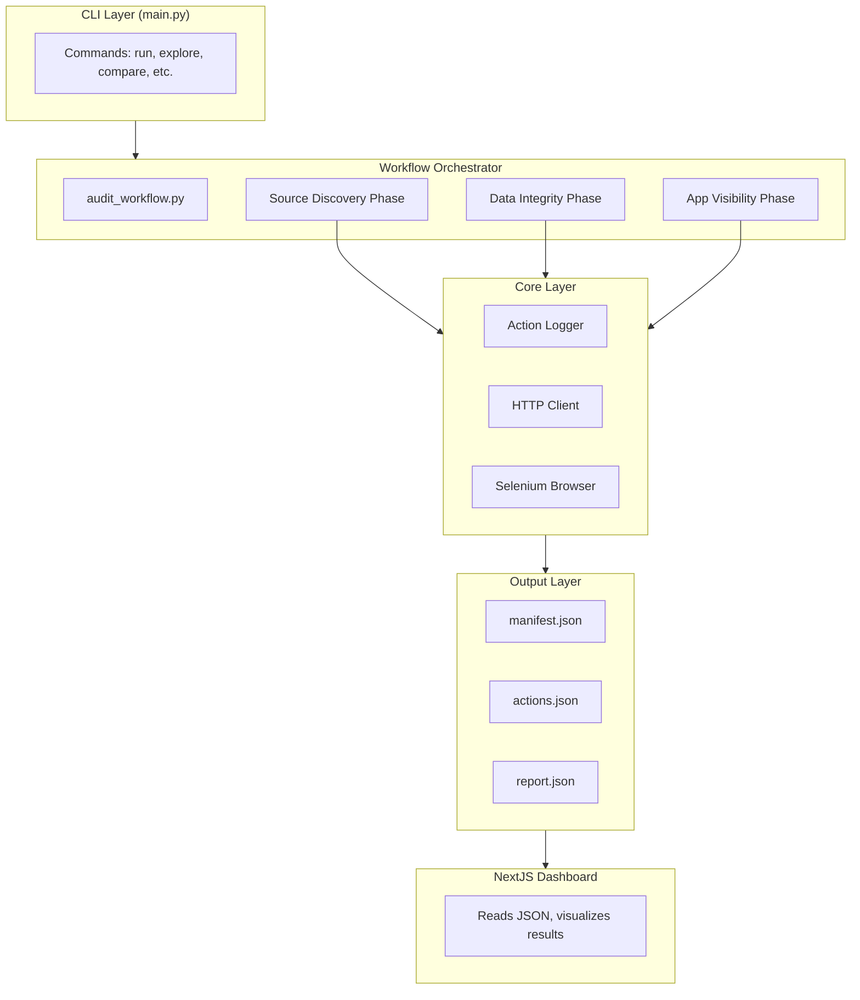
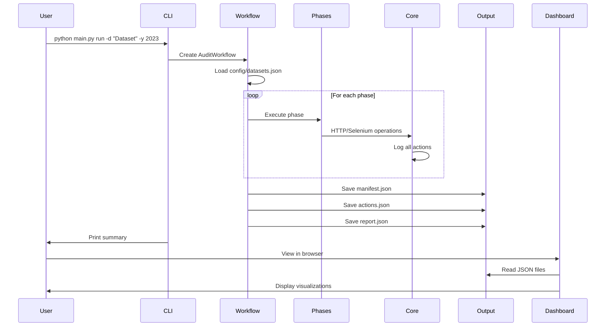

# Architecture

This document describes the system architecture of the AuthData Audit Framework.

## Overview

The framework follows a modular, phase-based architecture that separates concerns into distinct components:



## Components

### 1. CLI Layer (`main.py`)

The command-line interface built with [Click](https://click.palletsprojects.com/). Provides commands for:

| Command | Description |
|---------|-------------|
| `run` | Execute complete audit workflow |
| `source-check` | Run only source discovery phase |
| `data-check` | Run only data integrity phase |
| `explore` | Explore UI structure with Selenium |
| `extract-table` | Extract table data from web page |
| `compare` | Compare GitHub vs UI data |
| `verify-ui` | Verify dataset visibility in UI |
| `list-datasets` | List configured datasets |
| `list-runs` | List previous audit runs |
| `show` | Display audit run details |

### 2. Workflow Orchestrator

Coordinates the execution of audit phases in `workflows/audit_workflow.py`:

```python
class AuditWorkflow:
    def run(self, datasets, years, phases, headless, app_url) -> AuditReport:
        # 1. Load configuration
        # 2. Execute requested phases
        # 3. Combine results
        # 4. Generate report
        # 5. Save outputs
```

**Key Responsibilities:**
- Load dataset configurations from JSON
- Filter datasets and years based on parameters
- Execute phases in sequence
- Aggregate results into final report
- Save all outputs (manifest, actions, report)

### 3. Audit Phases

#### Phase A: Source Discovery

Verifies that source data exists on GitHub and has the expected structure.

```
Input: Dataset config with GitHub repo, file path, expected columns
Output: DatasetSourceInfo with exists, columns, row_count
```

**Actions Performed:**
1. Construct raw GitHub URL
2. HTTP GET to verify accessibility
3. Parse JSON to extract schema
4. Validate expected columns exist

#### Phase B: Data Integrity

Validates that data meets quality requirements.

```
Input: Dataset config with data URL, validations
Output: DataIntegrityResult with validation results
```

**Validation Types:**
- `min_rows`: Minimum row count check
- `value_not_empty`: Column has no empty values
- `numeric_column`: Column contains numeric values
- `schema_columns`: Expected columns exist

#### Phase C: App Visibility

Uses Selenium to verify data is displayed correctly in the web UI.

```
Input: App URL, dataset config with navigation steps
Output: UICheckResult with visible, elements_found, navigation_path
```

**Navigation Steps:**
- `click`: Click an element by selector
- `wait`: Wait for element to appear
- `delay`: Pause for specified seconds

### 4. Core Layer

#### Action Logger (`core/logger.py`)

Central logging system that records every action with full details:

```python
@dataclass
class Action:
    id: str                    # Unique action ID
    timestamp: str             # ISO 8601 timestamp
    phase: str                 # source_discovery, data_integrity, app_visibility
    action_type: str           # http_fetch, selenium_click, validation, etc.
    target: Target             # URL, selector information
    request: Request           # HTTP request details (if applicable)
    response: Response         # HTTP response details (if applicable)
    extraction: Extraction     # Data extraction details (if applicable)
    duration_ms: int           # Action duration
    status: str                # success or failure
    error: Optional[str]       # Error message if failed
    metadata: dict             # Additional context
```

#### HTTP Client (`core/http_client.py`)

Wrapper around `requests` that logs all HTTP operations:

```python
class LoggedHttpClient:
    def fetch_json(self, url) -> tuple[dict, Optional[str]]
    def verify_url_accessible(self, url) -> tuple[bool, Optional[str]]
```

**Logged Details:**
- Request method, headers
- Response status, headers, body (full)
- Duration in milliseconds

#### Selenium Browser (`core/browser.py`)

Wrapper around Selenium WebDriver that logs all browser operations:

```python
class LoggedBrowser:
    def navigate(self, url) -> tuple[bool, Optional[str]]
    def click(self, selector, by) -> tuple[bool, Optional[str]]
    def wait_for_element(self, selector, by, timeout) -> tuple[bool, Optional[str]]
    def extract_text(self, selector, by) -> tuple[str, Optional[str]]
    def extract_elements(self, selector, by) -> tuple[list, Optional[str]]
```

### 5. Output Layer

All outputs are stored in `audit-results/{run_id}/`:

#### manifest.json

```json
{
  "run_id": "audit_20260131_093427",
  "started_at": "2026-01-31T09:34:27Z",
  "completed_at": "2026-01-31T09:35:12Z",
  "config": {
    "datasets": ["Top 10 Source Markets"],
    "years": [2023, 2024],
    "phases": ["source_discovery", "data_integrity", "app_visibility"]
  },
  "summary": {
    "total_actions": 83,
    "successful": 83,
    "failed": 0,
    "datasets_passed": 10,
    "datasets_failed": 0
  }
}
```

#### actions.json

```json
[
  {
    "id": "action_0001",
    "timestamp": "2026-01-31T09:34:27Z",
    "phase": "source_discovery",
    "action_type": "http_fetch",
    "target": {"url": "https://..."},
    "request": {"method": "GET", "headers": {...}},
    "response": {"status_code": 200, "body_preview": "...", "body_size": 1234},
    "duration_ms": 456,
    "status": "success"
  }
]
```

#### report.json

```json
{
  "run_id": "audit_20260131_093427",
  "config": {...},
  "summary": {...},
  "datasets": [
    {
      "dataset_name": "Top 10 Source Markets (2023)",
      "passed": true,
      "source_discovery": {...},
      "data_integrity": {...},
      "app_visibility": {...}
    }
  ]
}
```

### 6. Dashboard Layer

NextJS application that reads JSON outputs and provides visualization:

```
audit-dashboard/
├── app/
│   ├── page.tsx              # Lists all audit runs
│   └── runs/[id]/page.tsx    # Shows run details
├── components/
│   ├── ActionTimeline.tsx    # Step-by-step action viewer
│   ├── AuditReport.tsx       # Pass/fail summary
│   └── DataViewer.tsx        # Syntax-highlighted JSON
└── lib/
    └── data.ts               # Reads from audit-results/
```

## Data Flow

### Complete Audit Flow



## Design Decisions

### Why Selenium Over API?

The web application uses dynamic JavaScript rendering, so API-only testing wouldn't catch UI rendering issues. Selenium verifies the actual user experience.

### Why Log Full Response Bodies?

Complete observability is a core requirement. When debugging why an audit failed, having the full response data eliminates guesswork.

### Why JSON Output?

JSON is:
- Human-readable for debugging
- Machine-parseable for dashboards
- Version-control friendly
- Language-agnostic

### Why Separate Phases?

Separation allows:
- Running individual phases for faster debugging
- Parallel development of phases
- Clear responsibility boundaries
- Easier testing

## Extensibility Points

1. **New Datasets**: Add to `config/datasets.json`
2. **New Validations**: Extend `DataIntegrityPhase._run_validation()`
3. **New Navigation Steps**: Extend `AppVisibilityPhase.check_dataset_visibility()`
4. **New Dashboard Views**: Add components to `audit-dashboard/components/`
