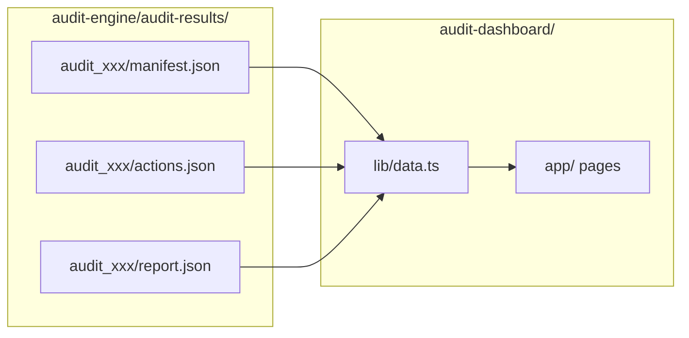

# Dashboard Guide

The AuthData Audit Dashboard is a NextJS application that provides visual exploration of audit results, including action timelines, request/response viewers, and summary reports.

## Overview

The dashboard reads JSON output files from the audit engine and presents them in an interactive web interface.

### Dashboard Home

The home page displays a list of all audit runs with their status, showing pass/fail indicators, action counts, and timestamps.


### Run Details View

Clicking on a run shows detailed results including configuration, phase results, and validation details for each dataset.


## Starting the Dashboard

### Development Mode

```bash
cd authdata/audit-dashboard

# Install dependencies (first time only)
npm install

# Start development server
npm run dev

# Or on a specific port
npm run dev -- -p 3002
```

### Production Build

```bash
cd authdata/audit-dashboard

# Build for production
npm run build

# Start production server
npm run start

# Or on a specific port
npm run start -- -p 3002
```

### Accessing the Dashboard

Open your browser to:
- http://localhost:3000 (default port)
- http://localhost:3002 (if using alternate port)

## Dashboard Pages

### Home Page (`/`)

The home page displays a list of all audit runs.

**Features:**
- List of audit runs sorted by date (newest first)
- Pass/fail status indicator
- Quick summary (actions, datasets passed)
- Click to view run details

**Information Displayed:**

| Field | Description |
|-------|-------------|
| Run ID | Unique identifier (e.g., `audit_20260131_093427`) |
| Started | Timestamp when audit began |
| Status | Overall pass/fail status |
| Actions | Total actions (successful/failed) |
| Datasets | Datasets passed/total |

### Run Details Page (`/runs/[id]`)

Detailed view of a specific audit run.

**Sections:**

#### Summary Panel
- Run ID and timestamps
- Configuration (datasets, years, phases)
- Overall statistics

#### Dataset Results
- List of all datasets with pass/fail status
- Click to expand dataset details

#### Action Timeline
- Chronological list of all actions
- Color-coded by status (green=success, red=failure)
- Click to expand action details

#### Action Details (Expanded)
- Full request information (method, URL, headers)
- Full response information (status, headers, body)
- Extraction results (query, result)
- Duration and error messages

## Dashboard Components

### ActionTimeline

Displays a chronological timeline of all audit actions with expandable details showing request/response data.


**Features:**
- Phase filtering (source_discovery, data_integrity, app_visibility)
- Status filtering (success, failure)
- Expandable action details with full request/response data
- Duration tracking for each action

### AuditReport

Displays the summary report with pass/fail indicators for each dataset, showing the three-phase audit results (Source Discovery, Data Integrity, App Visibility).


### DataViewer

Syntax-highlighted JSON viewer for request/response data, sample data comparison, and navigation steps with expandable element details.


**Features:**
- Syntax highlighting for JSON data
- Sample data preview with source/UI comparison
- Navigation step tracking
- Expandable sections for detailed inspection

## Data Flow



## Configuration

### Audit Results Path

The dashboard looks for audit results in a relative path. Configure in `lib/data.ts`:

```typescript
// Default configuration
const AUDIT_RESULTS_DIR = path.join(
  process.cwd(),
  '..',
  'audit-engine',
  'audit-results'
);
```

### Customizing the Path

To use a different results directory:

```typescript
// Custom path
const AUDIT_RESULTS_DIR = process.env.AUDIT_RESULTS_DIR ||
  path.join(process.cwd(), '..', 'audit-engine', 'audit-results');
```

Then set the environment variable:

```bash
export AUDIT_RESULTS_DIR="/path/to/audit-results"
npm run dev
```

## Styling

The dashboard uses Tailwind CSS for styling.

### Color Scheme

| Element | Color | Purpose |
|---------|-------|---------|
| Success | Green (`text-green-600`) | Passed actions/datasets |
| Failure | Red (`text-red-600`) | Failed actions/datasets |
| Info | Blue (`text-blue-600`) | Informational elements |
| Warning | Yellow (`text-yellow-600`) | Warnings |
| Background | Gray (`bg-gray-50`) | Page background |

## Troubleshooting

### Dashboard Shows "No Audit Runs Found"

1. Verify audit results exist:
```bash
ls -la authdata/audit-engine/audit-results/
```

2. Run at least one audit:
```bash
cd authdata/audit-engine
python main.py run -d "Top 10 Source Markets" -y 2023
```

3. Check path configuration in `lib/data.ts`

### Dashboard Won't Start

1. Verify Node.js version:
```bash
node --version  # Should be 18+
```

2. Reinstall dependencies:
```bash
rm -rf node_modules
npm install
```

3. Check for port conflicts:
```bash
# Use different port
npm run dev -- -p 3002
```

### Actions Not Loading

1. Check actions.json exists:
```bash
cat authdata/audit-engine/audit-results/<run_id>/actions.json
```

2. Verify JSON is valid:
```bash
python -m json.tool authdata/audit-engine/audit-results/<run_id>/actions.json
```

### Styling Issues

1. Clear Next.js cache:
```bash
rm -rf .next
npm run dev
```

2. Rebuild Tailwind:
```bash
npm run build
```
