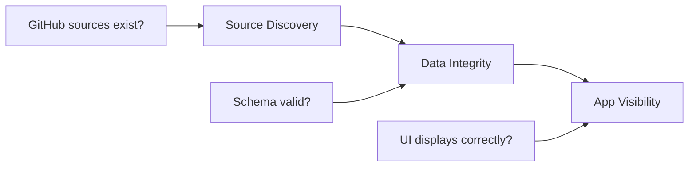

# Introduction

<span className="status-badge status-badge--alpha">ALPHA</span><span className="status-text">Early Development</span>

The **AuthData Audit Framework** is a reproducible, observable audit framework for validating datasets across the OpenGINXplore ecosystem with full action traceability and a NextJS visualization dashboard.

## Overview

When managing open data platforms, it's critical to ensure:

1. **Data Availability**: Source files exist and are accessible on GitHub
2. **Data Quality**: Data meets schema and validation requirements
3. **Data Visibility**: End users can see the correct data in the UI

Manual verification is error-prone and time-consuming. This framework automates the entire verification process with detailed logging for complete transparency.

## Three-Phase Auditing

The framework validates data through three distinct phases:



### Phase A: Source Discovery

Verifies that source data exists on GitHub and has the expected structure:
- Construct raw GitHub URL
- HTTP GET to verify accessibility
- Parse JSON to extract schema
- Validate expected columns exist

### Phase B: Data Integrity

Validates that data meets quality requirements:
- Minimum row count checks
- Column value validation (not empty, numeric)
- Schema column verification

### Phase C: App Visibility

Uses Selenium to verify data is displayed correctly in the web UI:
- Navigate complex UI hierarchies
- Configurable click sequences with delays
- Table data extraction and comparison

## Key Features

- **Full Observability**: Every HTTP request/response logged with headers and body, every Selenium action logged with selectors and results
- **Tree Navigation Support**: Navigate complex UI hierarchies (e.g., Tourism → Arrivals → By Country)
- **CLI Tools**: Run full audits or individual phases, explore UI structure interactively
- **NextJS Dashboard**: Visual timeline of all audit actions with pass/fail summary reports

## Quick Start

### Prerequisites

- Python 3.10+
- Node.js 18+ (for dashboard)
- Chrome browser (for Selenium)
- ChromeDriver (matching Chrome version)

### Installation

```bash
# Navigate to the audit engine
cd authdata/audit-engine

# Create virtual environment
python -m venv venv
source venv/bin/activate  # On Windows: venv\Scripts\activate

# Install dependencies
pip install -r requirements.txt

# Verify installation
python main.py --version
```

### Run Your First Audit

```bash
# Run a complete audit for all datasets
python main.py run

# Run audit for a specific dataset and year
python main.py run -d "Top 10 Source Markets" -y 2023

# View the results
python main.py show <run_id>
```

### Start the Dashboard

```bash
cd ../audit-dashboard
npm install
npm run dev -- -p 3002
# Open http://localhost:3002
```

## Project Structure

```
authdata/
├── audit-engine/                 # Python automation engine
│   ├── main.py                   # CLI entry point
│   ├── config/
│   │   └── datasets.json         # Dataset configurations
│   ├── core/                     # Logging, HTTP client, browser
│   ├── phases/                   # Source, integrity, visibility phases
│   ├── workflows/                # Main orchestrator
│   ├── tools/                    # UI explorer, data comparator
│   └── audit-results/            # Generated audit outputs
│
└── audit-dashboard/              # NextJS visualization
    ├── app/                      # Dashboard pages
    ├── components/               # UI components
    └── lib/                      # Data loading utilities
```

## Next Steps

- [Architecture](./architecture) - Understand the system design and data flow
- [Configuration](./configuration) - Learn about dataset configuration schema
- [CLI Reference](./cli-reference) - Explore all available commands
- [Dashboard](./dashboard) - Using the NextJS visualization UI
