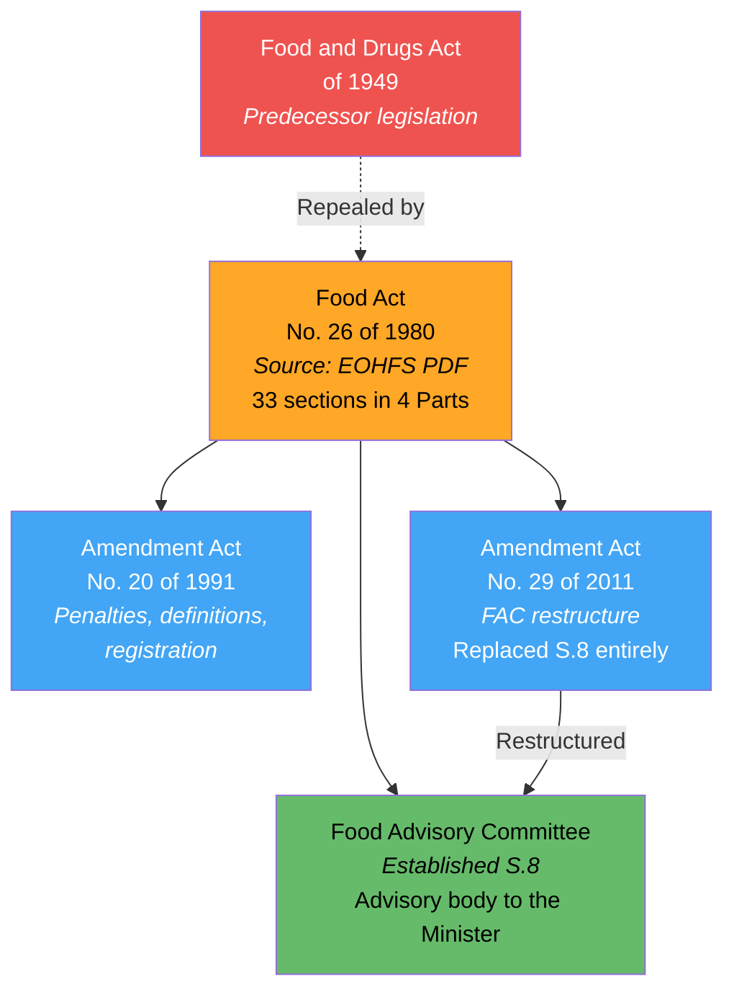
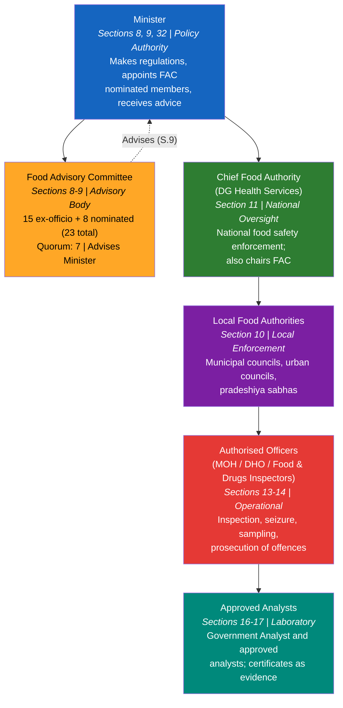
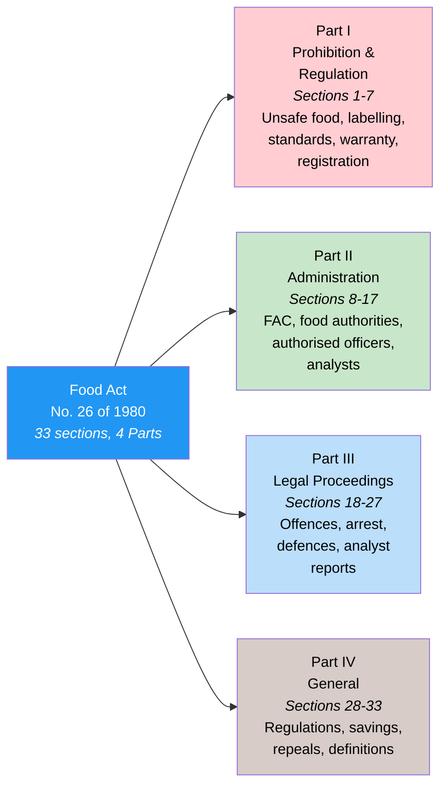
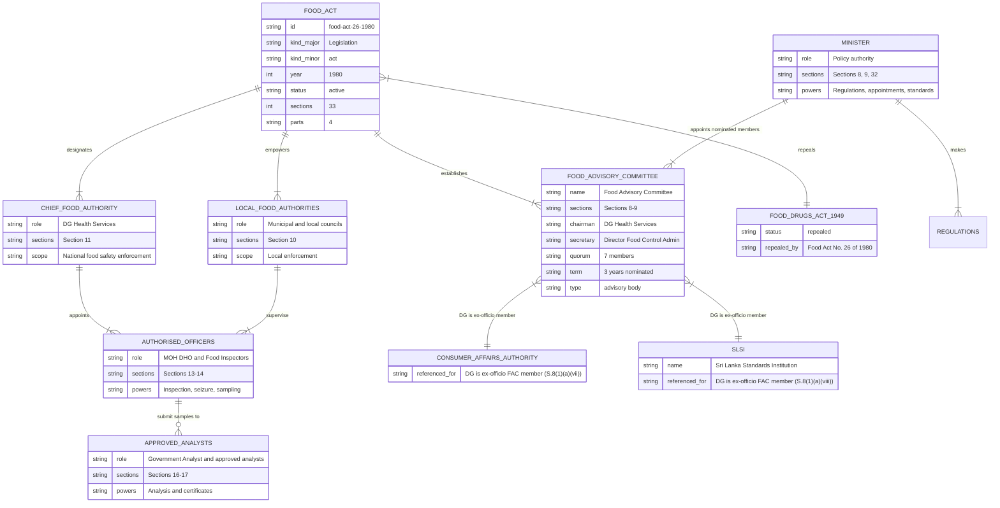

# Food Act — Lineage & Amendments

Visual diagrams showing the legislative lineage of the Food Act, No. 26 of 1980. This Act is Sri Lanka's primary food safety legislation, regulating the manufacture, importation, sale, and distribution of food. It repealed the Food and Drugs Act of 1949, established the Food Advisory Committee, and created a multi-tier enforcement system from the Chief Food Authority down to local authorised officers. The Act has been amended twice: No. 20 of 1991 (penalties, definitions, registration) and No. 29 of 2011 (FAC restructure).

## Amendment Flowchart

The 1980 Act repealed the Food and Drugs Act of 1949 and has been amended twice.

**Legend:** Red = repealed predecessor, Orange = source available, Green = statutory body established, Blue = amendments

### Source Documents

| Act | Year | Source | Link |
|-----|------|--------|------|
| Food Act, No. 26 of 1980 | 1980 | EOHFS (PDF) | [View](https://eohfs.health.gov.lk/food/images/pdf/acts/food_act_no26_1980_en.pdf) |
| Amendment Act No. 20 of 1991 | 1991 | Parliament (PDF) | [View](https://www.parliament.lk/uploads/acts/gbills/english/3484.pdf) |
| Amendment Act No. 29 of 2011 | 2011 | Parliament (PDF) | [View](https://www.parliament.lk/uploads/acts/gbills/english/5823.pdf) |

:::note Two amendments
This Act has been amended twice: No. 20 of 1991 (penalties, definitions, registration) and No. 29 of 2011 (FAC restructure replacing Section 8).
:::

## Governance Hierarchy

The Act creates a six-tier structure. The Minister sets policy and makes regulations. The Food Advisory Committee (23 members, quorum 7 — restructured by 2011 amendment) advises the Minister. The Director-General of Health Services serves dual roles as Chief Food Authority and FAC Chairman. Local authorities enforce food safety within their areas through authorised officers (MOH, DHO, Food & Drugs Inspectors — expanded by 1991 amendment). Approved analysts provide laboratory support.

**Legend:** Blue = Minister, Orange = Food Advisory Committee, Green = Chief Food Authority, Purple = local authorities, Red = authorised officers, Teal = approved analysts

## Act Structure

The Act has 33 sections organised into 4 Parts:

**Legend:** Blue = Act, Red (light) = prohibition and regulation, Green (light) = administration, Light blue = legal proceedings, Brown (light) = general provisions

## Entity-Relationship Diagram

