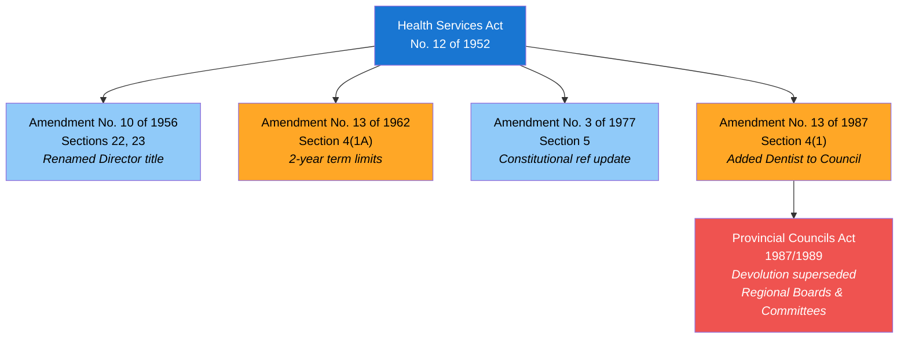
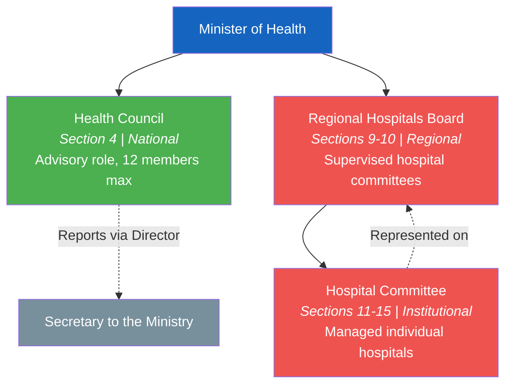
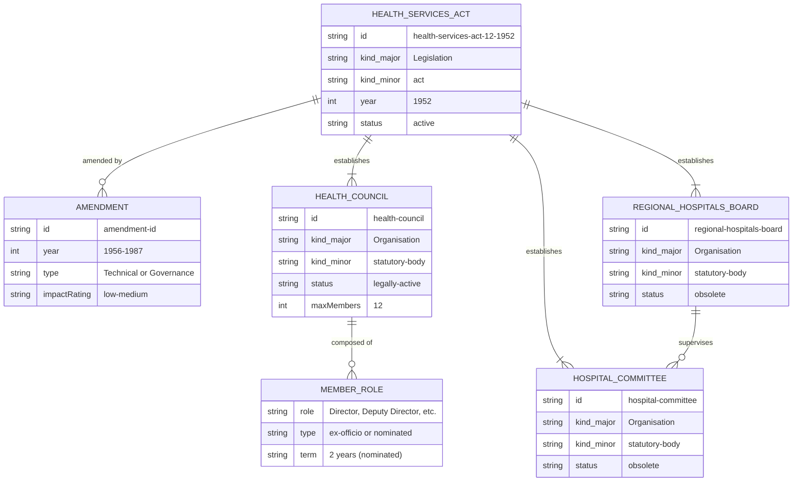

# Health Services Act — Lineage & Amendments

Visual diagrams showing how the Health Services Act, No. 12 of 1952 evolved through amendments and how the original governance hierarchy was structured.

## Amendment Flowchart

The Health Services Act has been amended four times between 1956 and 1987. Two amendments were administrative (low impact), and two changed governance structure (medium impact).

**Legend:** Blue = low impact, Orange = medium impact, Red = external supersession

### Source Documents

| Act | Year | Source | Link |
|-----|------|--------|------|
| Health Services Act, No. 12 of 1952 | 1952 | LawNet (HTML) | [View original act](https://www.lawnet.gov.lk/wp-content/uploads/Legislative_html/1956Y8V219C.html) |
| Amendment No. 10 of 1956 | 1956 | LawNet (HTML, incorporated) | [View source](https://www.lawnet.gov.lk/wp-content/uploads/Legislative_html/1956Y8V219C.html) |
| Amendment No. 13 of 1962 | 1962 | CommonLII | [View source](https://www.commonlii.org/lk/legis/num_act/hsa13o1962287/) |
| Amendment No. 3 of 1977 | 1977 | Lanka Law (HTML) | [View source](https://lankalaw.net/wp-content/uploads/2025/02/1977Y0V0C3A.html) |
| Amendment No. 13 of 1987 | 1987 | Lanka Law (PDF) | [View PDF](https://lankalaw.net/wp-content/uploads/2024/02/3390.pdf) |

## Governance Hierarchy (Original 1952 Design)

The Health Services Act established a three-tier governance structure. The top tier (Health Council) remains legally active, while the lower two tiers were superseded by provincial devolution in 1989.

**Legend:** Green = legally active, Red = obsolete (superseded 1989), Gray = reporting target

## Entity-Relationship Diagram

This ER diagram shows the structural relationships between entities defined in the Health Services Act, modeled using OpenGIN-compatible entity types.

