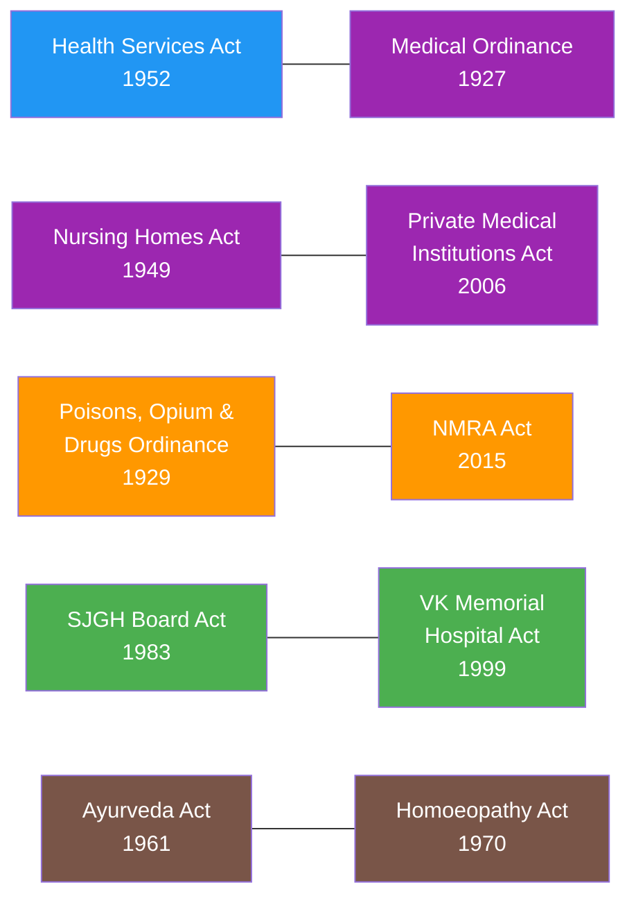

# Act Lineage

This section maps how acts under the Health Ministry relate to each other and how they evolved through amendments. Select an act below to explore its amendment history, governance structures, and deep analysis.

## Cross-Reference Network

Acts under the Health Ministry do not exist in isolation. Several acts reference or complement each other.

**Colors by domain:** Blue = Health Administration, Purple = Medical Regulation, Orange = Food & Drug Safety, Green = Hospital Management, Brown = Traditional Medicine

### Act Sources

| Act | Year | Source | Link |
|-----|------|--------|------|
| Health Services Act, No. 12 of 1952 | 1952 | LawNet (HTML) | [View source](https://www.lawnet.gov.lk/wp-content/uploads/Legislative_html/1956Y8V219C.html) |
| Medical Ordinance, No. 26 of 1927 | 1927 | SLMC (PDF) | [View PDF](http://www.au.slmc.gov.lk/wp-content/uploads/2023/02/Medical-Ordinance.pdf) |
| Nursing Homes Act, No. 16 of 1949 | 1949 | CommonLII (PDF) | [View PDF](http://www.commonlii.org/lk/legis/consol_act/nh551326.pdf) |
| Private Medical Institutions Act, No. 21 of 2006 | 2006 | PHSRC (PDF) | [View PDF](http://www.phsrc.lk/content/files/acts/ACT,No.21-2006_E.pdf) |
| Poisons, Opium & Drugs Ordinance, No. 17 of 1929 | 1929 | NDDCB (PDF) | [View PDF](https://www.nddcb.gov.lk/Docs/acts/25345.pdf) |
| NMRA Act, No. 5 of 2015 | 2015 | LawNet (HTML) | [View source](https://www.lawnet.gov.lk/wp-content/uploads/Law%20Site/4-stats_1956_2006/set6/2006Y0V0C5A.html) |
| SJGH Board Act, No. 54 of 1983 | 1983 | SriLankaLaw (PDF) | [View PDF](https://www.srilankalaw.lk/YearWisePdf/1983/SRI%20JAYEWARDENEPURA%20GENERAL%20HOSPITAL%20BOARD%20ACT,%20NO.%2054%20OF%201983.pdf) |
| VK Memorial Hospital Act, No. 38 of 1999 | 1999 | Gov.lk (PDF) | [View PDF](https://documents.gov.lk/view/acts/1999/11/38-1999_E.pdf) |
| Ayurveda Act, No. 31 of 1961 | 1961 | National Library (PDF) | [View PDF](https://diglib.natlib.lk/bitstream/handle/123456789/42201/255_CEYLON%20GOVERNMENT%20GAZETTE_1961-MAY-JUNE_AYURVEDA%20ACT_NO-31_02-06-1961_E.pdf?sequence=1&isAllowed=y) |
| Homoeopathy Act, No. 7 of 1970 | 1970 | Lanka Law (HTML) | [View source](https://lankalaw.net/wp-content/uploads/2025/02/1970Y0V0C7A.html) |
