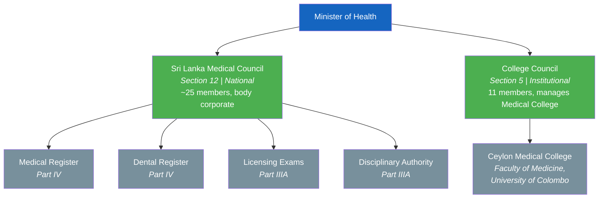
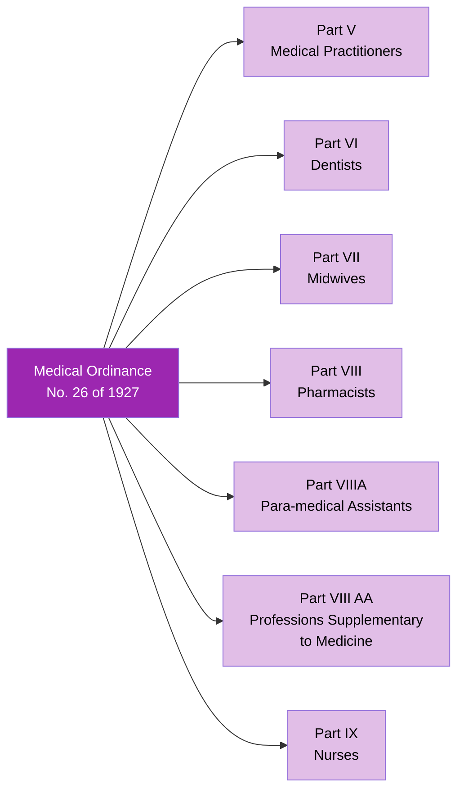
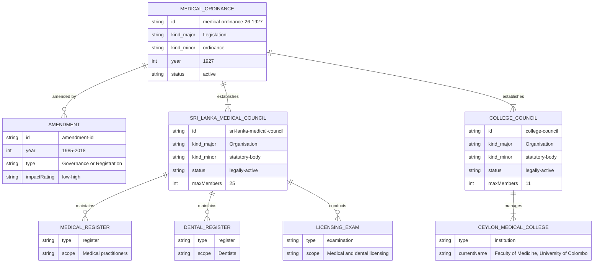

# Medical Ordinance — Lineage & Amendments

Visual diagrams showing how the Medical Ordinance, No. 26 of 1927 evolved through its extensive amendment history. This is one of Sri Lanka's most-amended pieces of legislation, with 9 major amendments spanning nearly a century.

## Amendment Flowchart

The Medical Ordinance has been amended nine times between 1985 and 2018. The 1985 amendment was transformative, adding an entire new Part (IIIA) to the Ordinance.

```mermaid
flowchart TD
    A["Medical Ordinance<br/>No. 26 of 1927"] --> B["Amendment No. 23 of 1985<br/>Added Part IIIA<br/><i>Medical Council regulatory powers</i>"]
    A --> C["Amendment No. 30 of 1987<br/>Section 13<br/><i>Council composition restructured</i>"]
    A --> D["Amendment No. 25 of 1988<br/>Section 13<br/><i>Election procedures refined</i>"]
    A --> E["Amendment No. 15 of 1996<br/>Part V<br/><i>Registration provisions updated</i>"]
    A --> F["Amendment No. 33 of 1997<br/>Various<br/><i>Administrative changes</i>"]
    A --> G["Amendment No. 40 of 1998<br/>Part III, IIIA<br/><i>Governance strengthened</i>"]
    A --> H["Amendment No. 6 of 2014<br/>Various<br/><i>Regulatory authority updated</i>"]
    A --> I["Amendment No. 1 of 2017<br/>Sections 13, 22B-22M<br/><i>Council & powers modified</i>"]
    A --> J["Amendment No. 28 of 2018<br/>Section 13, Various<br/><i>Latest structural update</i>"]

    click A "http://www.au.slmc.gov.lk/wp-content/uploads/2023/02/Medical-Ordinance.pdf" "View consolidated ordinance (PDF)" _blank
    click B "https://www.parliament.lk/uploads/acts/gbills/english/3267.pdf" "View amendment PDF" _blank
    click C "https://www.parliament.lk/uploads/acts/gbills/english/3407.pdf" "View amendment PDF" _blank
    click D "https://www.parliament.lk/uploads/acts/gbills/english/3449.pdf" "View amendment PDF" _blank
    click E "https://www.parliament.lk/uploads/acts/gbills/english/3250.pdf" "View amendment PDF" _blank
    click F "https://documents.gov.lk/view/acts/1997/12/33-1997_E.pdf" "View amendment PDF" _blank
    click G "https://documents.gov.lk/view/acts/1998/6/40-1998_E.pdf" "View amendment PDF" _blank
    click H "https://documents.gov.lk/view/acts/2014/4/06-2014_E.pdf" "View amendment PDF" _blank
    click I "https://documents.gov.lk/view/acts/2017/2/01-2017_E.pdf" "View amendment PDF" _blank
    click J "https://documents.gov.lk/view/acts/2018/9/28-2018_E.pdf" "View amendment PDF" _blank

    style A fill:#1976D2,color:#fff
    style B fill:#EF5350,color:#fff
    style C fill:#FFA726,color:#000
    style D fill:#FFA726,color:#000
    style E fill:#FFA726,color:#000
    style F fill:#90CAF9,color:#000
    style G fill:#EF5350,color:#fff
    style H fill:#FFA726,color:#000
    style I fill:#FFA726,color:#000
    style J fill:#FFA726,color:#000
```

**Legend:** Blue = base act / low impact, Orange = medium impact, Red = high impact (transformative)

### Source Documents

| Act | Year | Source | Link |
|-----|------|--------|------|
| Medical Ordinance, No. 26 of 1927 | 1927 | SLMC (PDF, consolidated) | [View PDF](http://www.au.slmc.gov.lk/wp-content/uploads/2023/02/Medical-Ordinance.pdf) |
| Amendment No. 23 of 1985 | 1985 | Parliament.lk (PDF) | [View PDF](https://www.parliament.lk/uploads/acts/gbills/english/3267.pdf) |
| Amendment No. 30 of 1987 | 1987 | Parliament.lk (PDF) | [View PDF](https://www.parliament.lk/uploads/acts/gbills/english/3407.pdf) |
| Amendment No. 25 of 1988 | 1988 | Parliament.lk (PDF) | [View PDF](https://www.parliament.lk/uploads/acts/gbills/english/3449.pdf) |
| Amendment No. 15 of 1996 | 1996 | Parliament.lk (PDF) | [View PDF](https://www.parliament.lk/uploads/acts/gbills/english/3250.pdf) |
| Amendment No. 33 of 1997 | 1997 | Gov.lk (PDF) | [View PDF](https://documents.gov.lk/view/acts/1997/12/33-1997_E.pdf) |
| Amendment No. 40 of 1998 | 1998 | Gov.lk (PDF) | [View PDF](https://documents.gov.lk/view/acts/1998/6/40-1998_E.pdf) |
| Amendment No. 6 of 2014 | 2014 | Gov.lk (PDF) | [View PDF](https://documents.gov.lk/view/acts/2014/4/06-2014_E.pdf) |
| Amendment No. 1 of 2017 | 2017 | Gov.lk (PDF) | [View PDF](https://documents.gov.lk/view/acts/2017/2/01-2017_E.pdf) |
| Amendment No. 28 of 2018 | 2018 | Gov.lk (PDF) | [View PDF](https://documents.gov.lk/view/acts/2018/9/28-2018_E.pdf) |

## Governance Hierarchy (Ordinance Design)

The Medical Ordinance established a two-tier governance structure. Unlike the Health Services Act, both tiers remain legally active and the Medical Council is fully operational today.

**Legend:** Green = legally active, Gray = functions / subordinate entities

## Scope of Regulation

The Medical Ordinance covers a remarkably broad scope of health professions through its 10 Parts:

## Entity-Relationship Diagram

