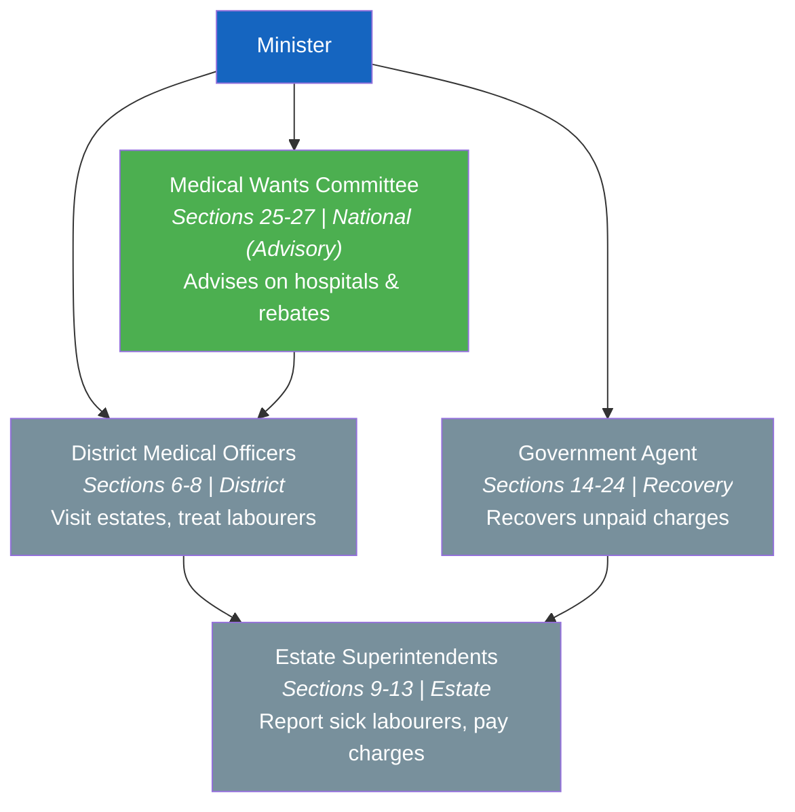
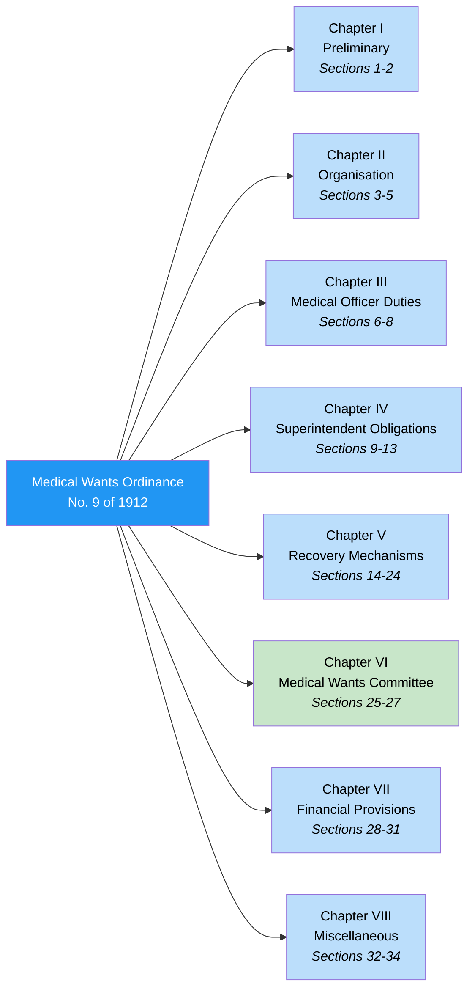
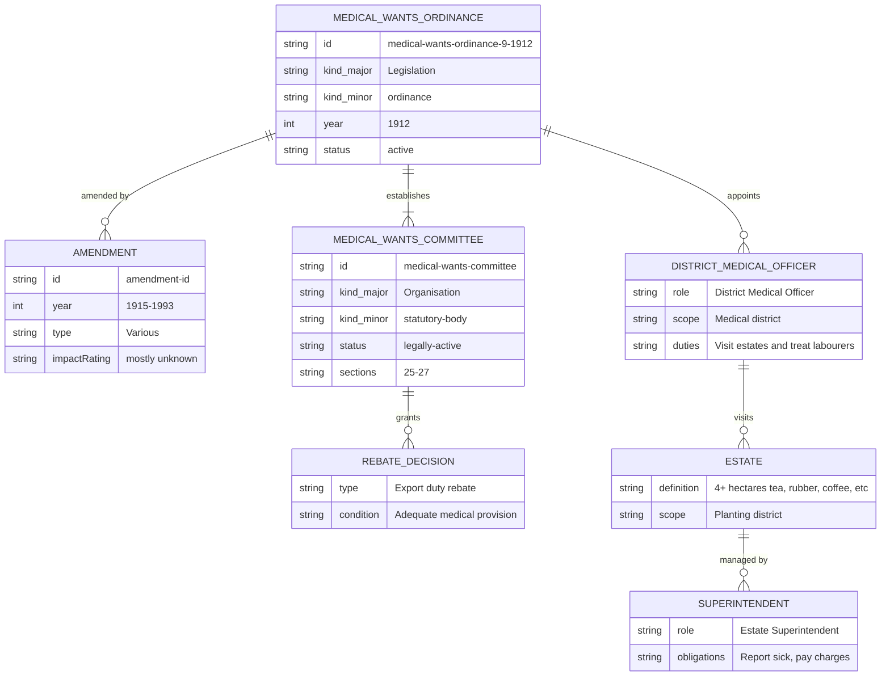

# Medical Wants Ordinance — Lineage & Amendments

Visual diagrams showing how the Medical Wants Ordinance, No. 9 of 1912 evolved through its 11 amendments over more than 80 years. This is one of Sri Lanka's oldest pieces of health legislation, originally enacted to provide medical care for estate labourers in planting districts during the British colonial period.

## Amendment Flowchart

The Medical Wants Ordinance has been amended 11 times between 1915 and 1993. Four amendments have accessible scanned PDFs (1957, 1958, 1990, 1993). The 1974 amendment is listed on Parliament.lk but its PDF is unavailable. Five colonial/early-era amendments have no digital records.

```mermaid
flowchart TD
    A["Medical Wants Ordinance<br/>No. 9 of 1912"] --> B["Amendment No. 16 of 1915<br/><i>Pre-digital, no text available</i>"]
    A --> C["Amendment No. 25 of 1916<br/><i>Pre-digital, no text available</i>"]
    A --> D["Amendment No. 29 of 1916<br/><i>Pre-digital, no text available</i>"]
    A --> E["Amendment No. 36 of 1946<br/><i>Post-war, pre-digital</i>"]
    A --> F["Amendment No. 46 of 1957<br/><i>Endorsed 1957-10-25 (scanned PDF)</i>"]
    A --> G["Amendment No. 35 of 1958<br/><i>Endorsed 1958-11-03 (scanned PDF)</i>"]
    A --> H["Amendment No. 2 of 1966<br/><i>Pre-digital, no text available</i>"]
    A --> I["Law No. 28 of 1974<br/><i>Endorsed 1974-08-19 (PDF unavailable)</i>"]
    A --> J["Amendment No. 10 of 1983<br/><i>Confirmed, no PDF available</i>"]
    A --> K["Amendment No. 33 of 1990<br/><i>Only accessible PDF (scanned)</i>"]
    A --> L["Amendment No. 53 of 1993<br/><i>Most recent (scanned PDF)</i>"]

    click A "https://employers.lk/wp-content/uploads/2021/03/5_Medical-Wants-Ordinance-No.9-of-1912.pdf" "View base ordinance (PDF)" _blank
    click F "https://www.parliament.lk/uploads/acts/gbills/english/3657.pdf" "View amendment PDF (scanned)" _blank
    click G "https://www.parliament.lk/uploads/acts/gbills/english/3785.pdf" "View amendment PDF (scanned)" _blank
    click I "https://www.parliament.lk/en/business-of-parliament/act-details/G4138" "View act details (PDF unavailable)" _blank
    click K "https://documents.gov.lk/view/acts/1990/9/33-1990_E.pdf" "View amendment PDF (scanned)" _blank
    click L "https://www.parliament.lk/uploads/acts/gbills/english/3256.pdf" "View amendment PDF (scanned)" _blank

    style A fill:#1976D2,color:#fff
    style B fill:#9E9E9E,color:#fff
    style C fill:#9E9E9E,color:#fff
    style D fill:#9E9E9E,color:#fff
    style E fill:#9E9E9E,color:#fff
    style F fill:#FFA726,color:#000
    style G fill:#FFA726,color:#000
    style H fill:#9E9E9E,color:#fff
    style I fill:#FFE082,color:#000
    style J fill:#9E9E9E,color:#fff
    style K fill:#FFA726,color:#000
    style L fill:#FFA726,color:#000
```

**Legend:** Blue = base ordinance, Orange = accessible PDF available, Light yellow = listed but PDF unavailable, Gray = no accessible source

### Source Documents

| Act | Year | Source | Link |
|-----|------|--------|------|
| Medical Wants Ordinance, No. 9 of 1912 | 1912 | Employers Federation (PDF) | [View PDF](https://employers.lk/wp-content/uploads/2021/03/5_Medical-Wants-Ordinance-No.9-of-1912.pdf) |
| Amendment No. 16 of 1915 | 1915 | Pre-digital, no PDF | — |
| Amendment No. 25 of 1916 | 1916 | Pre-digital, no PDF | — |
| Amendment No. 29 of 1916 | 1916 | Pre-digital, no PDF | — |
| Amendment No. 36 of 1946 | 1946 | Pre-digital, no PDF | — |
| Amendment No. 46 of 1957 | 1957 | Parliament.lk (scanned PDF) | [View PDF](https://www.parliament.lk/uploads/acts/gbills/english/3657.pdf) |
| Amendment No. 35 of 1958 | 1958 | Parliament.lk (scanned PDF) | [View PDF](https://www.parliament.lk/uploads/acts/gbills/english/3785.pdf) |
| Amendment No. 2 of 1966 | 1966 | Not in Parliament database | — |
| Law No. 28 of 1974 | 1974 | Parliament.lk (listed, PDF unavailable); CommonLII (410 Gone) | [View Details](https://www.parliament.lk/en/business-of-parliament/act-details/G4138) |
| Amendment No. 10 of 1983 | 1983 | Confirmed by srilankalaw.lk; Parliament.lk returns different act | — |
| Amendment No. 33 of 1990 | 1990 | Gov.lk (scanned PDF) | [View PDF](https://documents.gov.lk/view/acts/1990/9/33-1990_E.pdf) |
| Amendment No. 53 of 1993 | 1993 | Parliament.lk (scanned PDF) | [View PDF](https://www.parliament.lk/uploads/acts/gbills/english/3256.pdf) |

## Governance Hierarchy (Ordinance Design)

The Medical Wants Ordinance established a four-tier governance structure for delivering medical care to estate labourers, funded through export duties on plantation produce.

**Legend:** Blue = Minister, Green = statutory body (legally active), Gray = operational roles

## Ordinance Structure

**Legend:** Green = establishes statutory body, Blue = operational provisions

## Entity-Relationship Diagram

