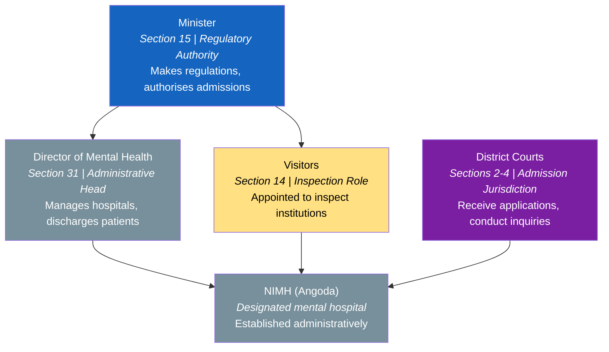
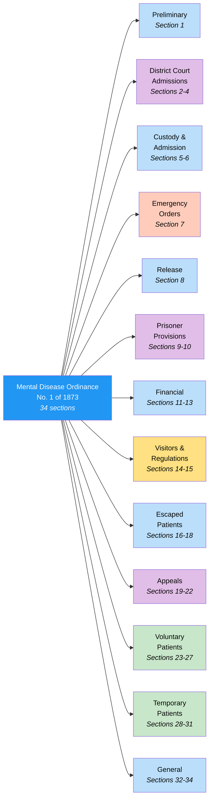
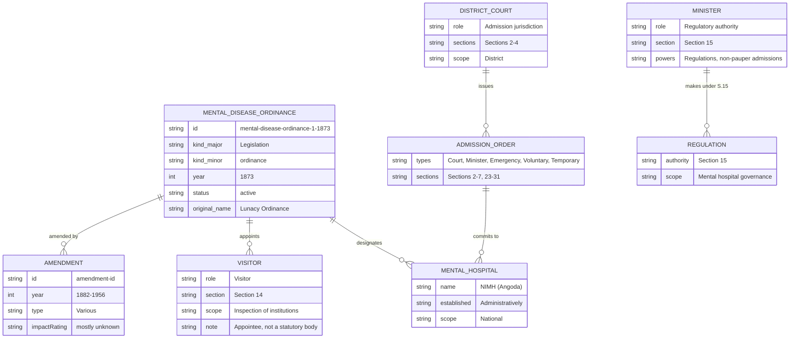

# Mental Disease Ordinance — Lineage & Amendments

Visual diagrams showing how the Mental Disease Ordinance, No. 1 of 1873 evolved through its 11 amendments over more than 80 years. Originally enacted as the **Lunacy Ordinance**, it is the oldest piece of mental health legislation in Sri Lanka — and remains in force today, 153 years after enactment, with no amendments since 1956.

## Amendment Flowchart

The Ordinance has been amended 11 times between 1882 and 1956. Two amendments have accessible scanned PDFs (1952, 1956). One amendment (1955) has a Parliament.lk cataloguing mismatch. The remaining 8 are pre-digital with no accessible text.

```mermaid
flowchart TD
    A["Lunacy Ordinance<br/>No. 1 of 1873"] --> B["Amendment No. 3 of 1882<br/><i>Pre-digital, no text available</i>"]
    A --> C["Amendment No. 3 of 1883<br/><i>Pre-digital, no text available</i>"]
    A --> D["Amendment No. 2 of 1889<br/><i>Pre-digital, no text available</i>"]
    A --> E["Amendment No. 13 of 1905<br/><i>Pre-digital, no text available</i>"]
    A --> F["Amendment No. 16 of 1919<br/><i>Pre-digital, no text available</i>"]
    A --> G["Amendment No. 3 of 1940<br/><i>Pre-digital, no text available</i>"]
    A --> H["Amendment No. 13 of 1940<br/><i>Pre-digital, no text available</i>"]
    A --> I["Amendment No. 11 of 1943<br/><i>Pre-digital, no text available</i>"]
    A --> J["Amendment No. 14 of 1952<br/><i>'Lunacy (Amendment)', endorsed 1952-03-21</i>"]
    A --> K["Amendment No. 22 of 1955<br/><i>Parliament.lk returns different act</i>"]
    A --> L["Amendment No. 27 of 1956<br/><i>Renamed to 'Mental Diseases Ordinance'</i>"]

    click A "https://www.commonlii.org/lk/legis/consol_act/md559196.pdf" "View consolidated ordinance (PDF)" _blank
    click J "https://www.parliament.lk/uploads/acts/gbills/english/5387.pdf" "View amendment PDF (scanned)" _blank
    click L "https://www.parliament.lk/uploads/acts/gbills/english/3157.pdf" "View amendment PDF (scanned)" _blank

    style A fill:#1976D2,color:#fff
    style B fill:#9E9E9E,color:#fff
    style C fill:#9E9E9E,color:#fff
    style D fill:#9E9E9E,color:#fff
    style E fill:#9E9E9E,color:#fff
    style F fill:#9E9E9E,color:#fff
    style G fill:#9E9E9E,color:#fff
    style H fill:#9E9E9E,color:#fff
    style I fill:#9E9E9E,color:#fff
    style J fill:#FFA726,color:#000
    style K fill:#FFE082,color:#000
    style L fill:#FFA726,color:#000
```

**Legend:** Blue = base ordinance, Orange = accessible PDF available, Light yellow = listed but source mismatch, Gray = no accessible source

### Source Documents

| Act | Year | Source | Link |
|-----|------|--------|------|
| Lunacy Ordinance, No. 1 of 1873 | 1873 | CommonLII (consolidated PDF) | [View PDF](https://www.commonlii.org/lk/legis/consol_act/md559196.pdf) |
| Amendment No. 3 of 1882 | 1882 | Pre-digital, no PDF | — |
| Amendment No. 3 of 1883 | 1883 | Pre-digital, no PDF | — |
| Amendment No. 2 of 1889 | 1889 | Pre-digital, no PDF | — |
| Amendment No. 13 of 1905 | 1905 | Pre-digital, no PDF | — |
| Amendment No. 16 of 1919 | 1919 | Pre-digital, no PDF | — |
| Amendment No. 3 of 1940 | 1940 | Pre-digital, no PDF | — |
| Amendment No. 13 of 1940 | 1940 | Pre-digital, no PDF | — |
| Amendment No. 11 of 1943 | 1943 | Pre-digital, no PDF | — |
| Amendment No. 14 of 1952 | 1952 | Parliament.lk (scanned PDF, G5387) | [View PDF](https://www.parliament.lk/uploads/acts/gbills/english/5387.pdf) |
| Amendment No. 22 of 1955 | 1955 | Parliament.lk returns "Administrative Districts" — mismatch | — |
| Amendment No. 27 of 1956 | 1956 | Parliament.lk (scanned PDF, G3157) | [View PDF](https://www.parliament.lk/uploads/acts/gbills/english/3157.pdf) |

## Governance Hierarchy (Ordinance Design)

The Mental Disease Ordinance establishes a governance framework centred on the Minister's regulatory authority and the District Courts' admission jurisdiction. Unlike most health legislation, no statutory body is created — instead, "Visitors" are appointed under Section 14 in an inspection role.

**Legend:** Blue = Minister, Purple = judicial authority, Yellow = appointed role (not a statutory body), Gray = operational roles

## Ordinance Structure

The Ordinance has a flat section structure (no chapter divisions) with 34 sections grouped by topic:

**Legend:** Blue = general provisions, Purple = court/judicial provisions, Orange = emergency, Yellow = inspection/regulation, Green = voluntary/temporary admission (later additions)

## Entity-Relationship Diagram

