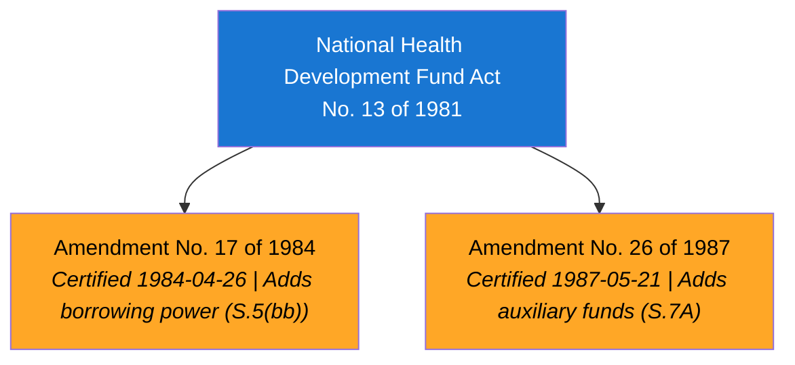
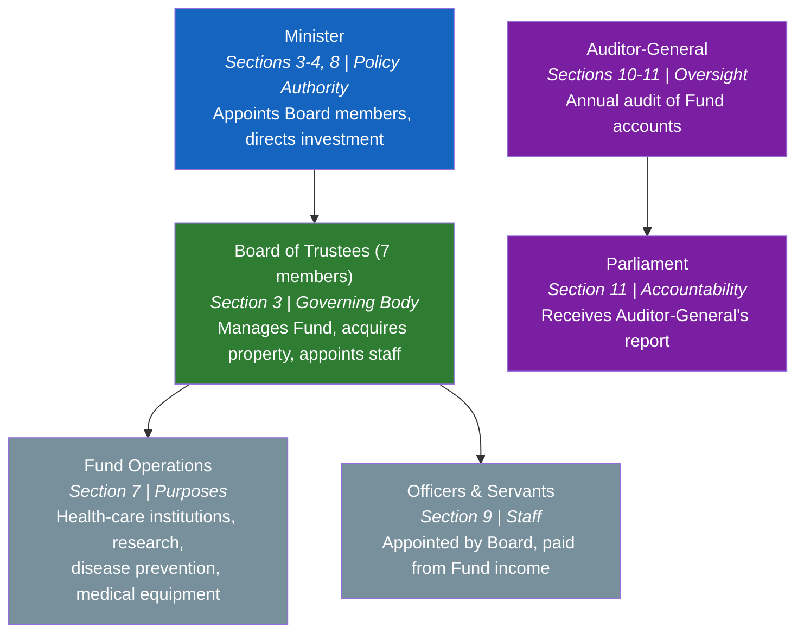
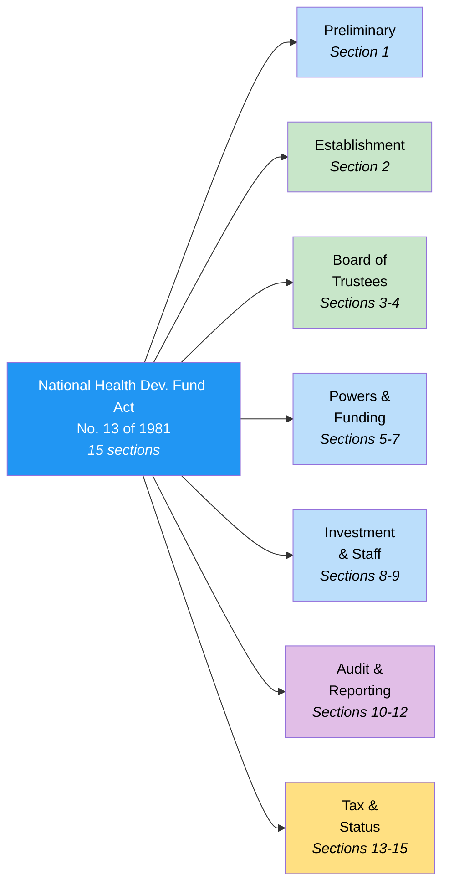
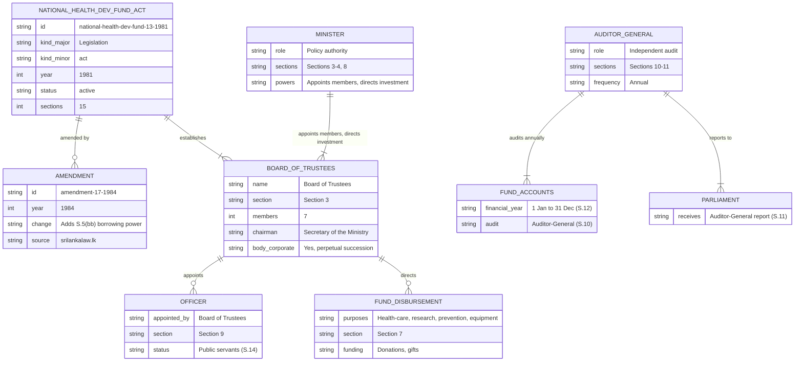

# National Health Development Fund Act — Lineage & Amendments

Visual diagrams showing how the National Health Development Fund Act, No. 13 of 1981 has evolved. The Act establishes a fund and Board of Trustees for the development and improvement of health services in Sri Lanka. It has been amended twice: in 1984 (borrowing power) and 1987 (auxiliary funds).

## Amendment Flowchart

The Act has been amended twice. All sources are accessible online.

**Legend:** Blue = base Act, Orange = accessible source available

### Source Documents

| Act | Year | Source | Link |
|-----|------|--------|------|
| National Health Development Fund Act, No. 13 of 1981 | 1981 | LawNet (HTML) | [View](https://www.lawnet.gov.lk/national-health-development-fund-3/) |
| Amendment No. 17 of 1984 | 1984 | srilankalaw.lk (PDF) | [View PDF](https://www.srilankalaw.lk/YearWisePdf/1984/NATIONAL%20HEALTH%20DEVELOPMENT%20FUND%20(AMENDMENT)%20ACT,%20NO.%2017%20OF%201984.pdf) |
| Amendment No. 26 of 1987 | 1987 | LawNet (HTML) | [View](http://www.lawnet.gov.lk/wp-content/uploads/Law%20Site/4-stats_1956_2006/set4/1987Y0V0C26A.html) |

## Governance Hierarchy

The Act creates a simple governance structure: the Minister appoints and directs the Board of Trustees, which manages the Fund. The Auditor-General provides independent oversight and reports to Parliament.

**Legend:** Blue = Minister, Green = Board of Trustees, Gray = operational roles, Purple = oversight/accountability

## Act Structure

The Act has a flat section structure (no chapter or part divisions) with 15 sections:

**Legend:** Blue = general provisions, Green = establishment/governance, Purple = audit/reporting, Yellow = tax/legal status

## Entity-Relationship Diagram

