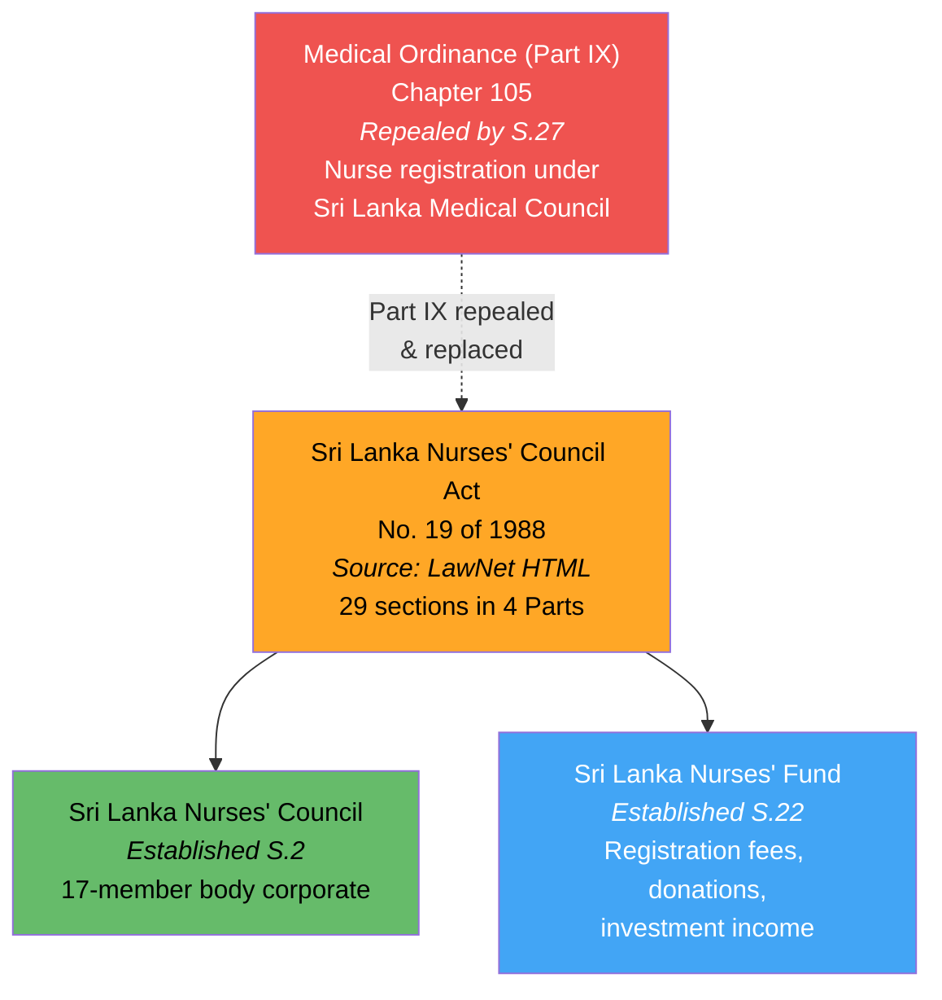
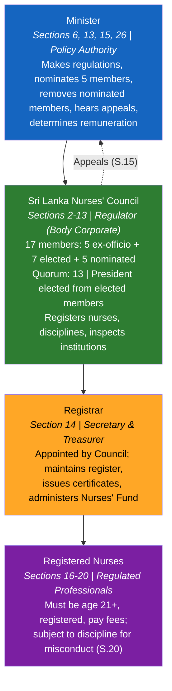
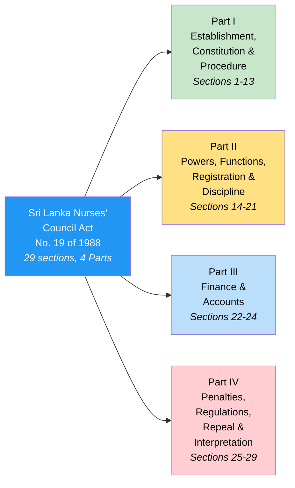
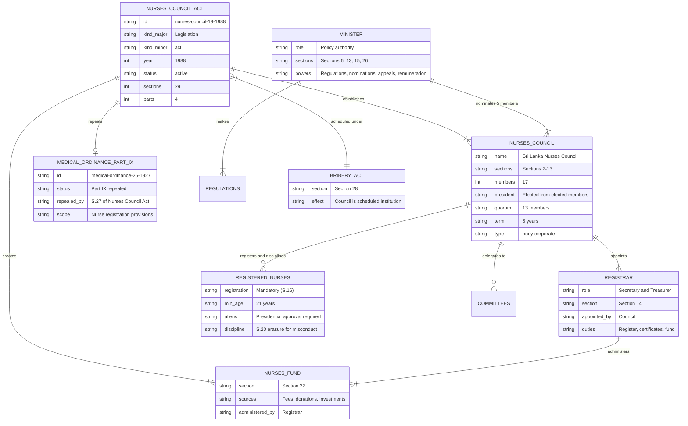

# Sri Lanka Nurses' Council Act — Lineage & Amendments

Visual diagrams showing the legislative lineage of the Sri Lanka Nurses' Council Act, No. 19 of 1988. This Act repealed Part IX of the Medical Ordinance (Chapter 105), which previously governed nurse registration, and established the Sri Lanka Nurses' Council as the sole regulatory body for the nursing profession. No amendments have been enacted.

## Amendment Flowchart

The 1988 Act has no amendments. The key legislative event is the **repeal** of Part IX of the Medical Ordinance via Section 27, transferring nurse registration from the Sri Lanka Medical Council to the new Nurses' Council.

**Legend:** Orange = source available, Red = repealed provision, Green = statutory body established, Blue = fund established

### Source Documents

| Act | Year | Source | Link |
|-----|------|--------|------|
| Sri Lanka Nurses' Council Act, No. 19 of 1988 | 1988 | LawNet (HTML) | [View](http://www.lawnet.gov.lk/wp-content/uploads/Law%20Site/4-stats_1956_2006/set4/1988Y0V0C19A.html) |
| Medical Ordinance, No. 26 of 1927 (Part IX repealed) | 1927 | SLMC website (PDF) | [View](http://www.au.slmc.gov.lk/wp-content/uploads/2023/02/Medical-Ordinance.pdf) |

:::note No amendments
This Act has not been amended since enactment in 1988.
:::

## Governance Hierarchy

The Act creates a four-tier regulatory structure. The Minister sets policy and makes regulations. The Sri Lanka Nurses' Council (17-member body corporate) registers and regulates nurses. The Registrar serves as Secretary, Treasurer, and maintains the register.

**Legend:** Blue = Minister, Green = Council (regulator), Orange = Registrar, Purple = regulated professionals

## Act Structure

The Act has 29 sections organised into 4 Parts:

**Legend:** Blue = Act, Green = establishment/governance, Yellow = powers/registration, Blue (light) = finance, Red (light) = penalties/repeal

## Entity-Relationship Diagram

