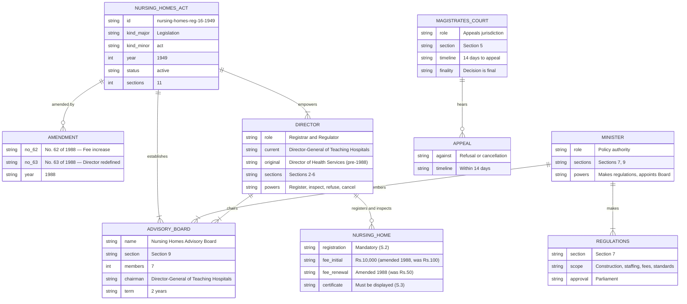

# Nursing Homes (Regulations) Act — Lineage & Amendments

Visual diagrams showing how the Nursing Homes (Regulations) Act, No. 16 of 1949 has evolved. The Act provides for the registration, regulation, supervision, and inspection of nursing homes in Sri Lanka. It was amended twice in 1988: No. 62 (fee increase) and No. 63 (redefined "Director").

## Amendment Flowchart

Both amendments were endorsed on the same date (17 December 1988). Amendment PDFs are available from parliament.lk.

**Legend:** Orange = source available

### Source Documents

| Act | Year | Source | Link |
|-----|------|--------|------|
| Nursing Homes (Regulations) Act, No. 16 of 1949 | 1949 | lankalaw.net (consolidated PDF via OCR) | [View PDF](https://lankalaw.net/wp-content/uploads/2024/03/nh551326.pdf) |
| Amendment No. 62 of 1988 | 1988 | parliament.lk | [View](https://www.parliament.lk/uploads/acts/gbills/english/3887.pdf) |
| Amendment No. 63 of 1988 | 1988 | parliament.lk | [View](https://www.parliament.lk/uploads/acts/gbills/english/3888.pdf) |

:::note Consolidated text header discrepancy
The consolidated text header lists "Acts Nos. 16 of 1949, 12 of 1952, 29 of 1953" as the source acts. However, Act No. 12 of 1952 is the [Health Services Act](https://www.parliament.lk/en/business-of-parliament/act-details/G5364) and Act No. 29 of 1953 is the [Assignment of Ministers' Functions (Consequential Provisions)](https://www.parliament.lk/en/business-of-parliament/acts-listing?actNo=29/1953) — neither is a direct amendment to the Nursing Homes Act. The actual amendments are Nos. 62 and 63 of 1988, identified from parliament.lk records.
:::

## Governance Hierarchy

The Act creates a regulatory structure centred on the Director (originally Director of Health Services; redefined by Amendment No. 63 of 1988 to Director-General of Teaching Hospitals), with the Nursing Homes Advisory Board in a purely advisory role. Appeals against the Director's decisions go to the Magistrate's Court.

**Legend:** Blue = Minister, Green = Director (regulator), Orange = Advisory Board, Purple = judicial oversight

## Act Structure

The Act has a flat section structure (no chapter or part divisions) with 11 sections:

**Legend:** Blue = general provisions, Green = establishment/governance, Red = refusal/cancellation, Purple = appeals, Yellow = regulations/penalties

## Entity-Relationship Diagram

