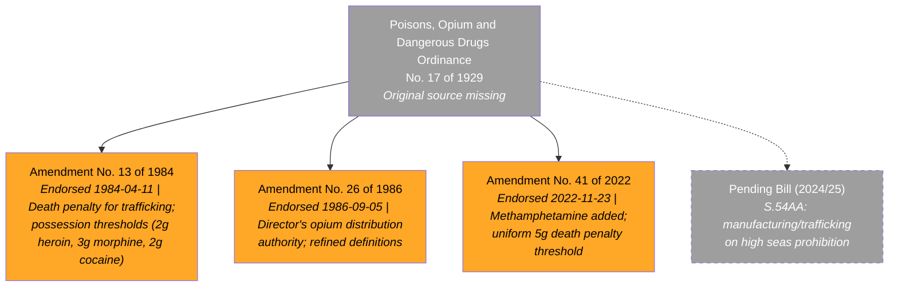
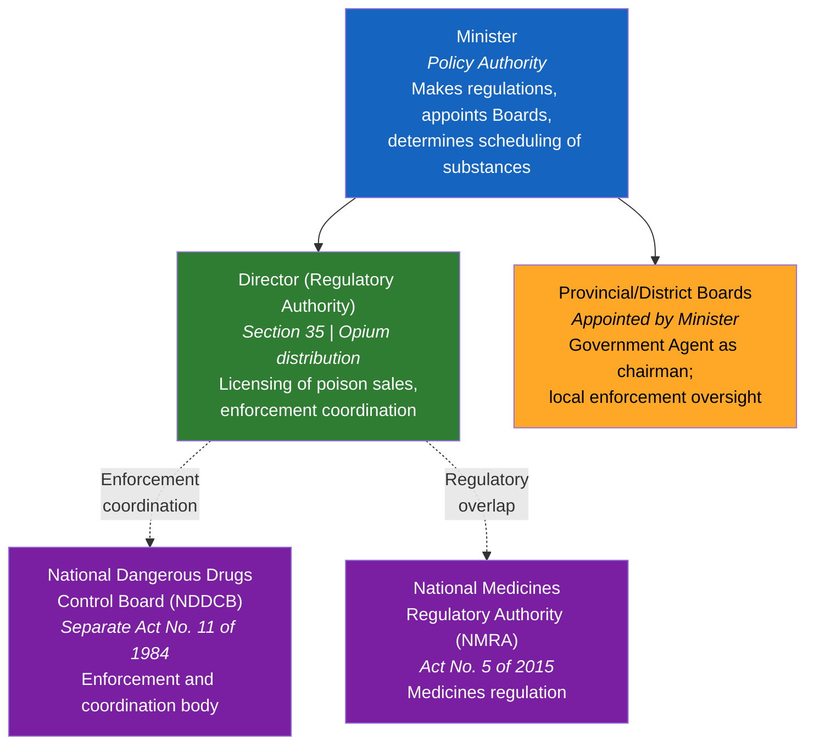
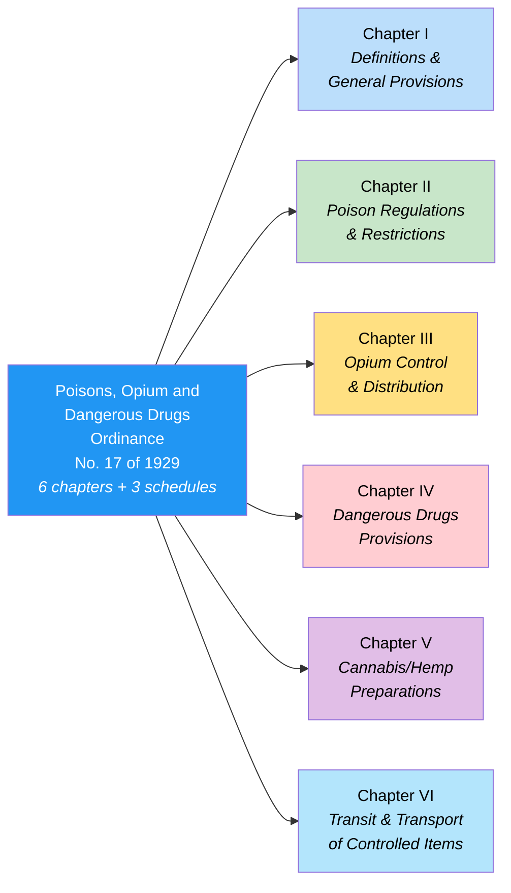
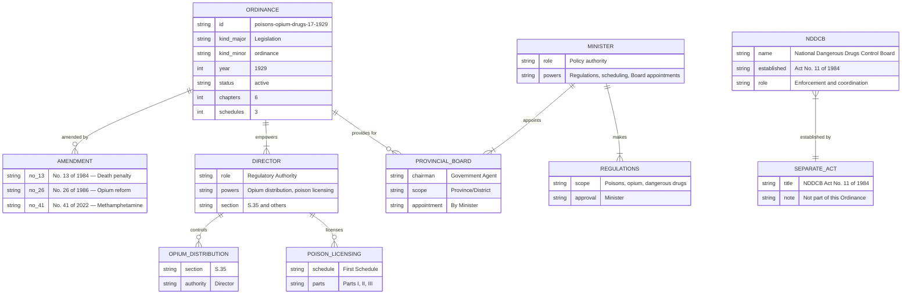

# Poisons, Opium and Dangerous Drugs Ordinance — Lineage & Amendments

Visual diagrams showing how the Poisons, Opium and Dangerous Drugs Ordinance, No. 17 of 1929 has evolved. This is Sri Lanka's principal drug control legislation — a large, multi-chapter ordinance that has been significantly strengthened over time, notably with the introduction of the death penalty for drug trafficking in 1984 and the addition of methamphetamine in 2022.

## Amendment Flowchart

Three confirmed amendments spanning nearly a century. All amendment PDFs are available from parliament.lk. A pending bill (2024/25) would extend jurisdiction to the high seas.

**Legend:** Orange = source available | Gray dashed = pending/not yet enacted

### Source Documents

| Document | Year | Source | Link |
|----------|------|--------|------|
| Poisons, Opium and Dangerous Drugs Ordinance, No. 17 of 1929 | 1929 | — | **Source missing** (original 1929 text not yet located online) |
| Consolidated text | 2024 | NDDCB | [View PDF](https://www.nddcb.gov.lk/Docs/acts/25345.pdf) |
| Consolidated text (2024) | 2024 | lankalaw.net | [View PDF](https://lankalaw.net/wp-content/uploads/2025/03/Poisons-Opium-And-Dangerous-Drugs-Consolidated-2024.pdf) |
| Amendment No. 13 of 1984 | 1984 | parliament.lk | [View](https://www.parliament.lk/uploads/acts/gbills/english/3201.pdf) |
| Amendment No. 26 of 1986 | 1986 | parliament.lk | [View](https://www.parliament.lk/uploads/acts/gbills/english/3358.pdf) |
| Amendment No. 41 of 2022 | 2022 | parliament.lk | [View](https://www.parliament.lk/uploads/acts/gbills/english/6277.pdf) |

:::note Additional amendments
There may be additional historical amendments between 1929 and 1984 that have not yet been identified. The three amendments listed here are confirmed with PDFs from parliament.lk.
:::

## Governance Hierarchy

The Ordinance creates a regulatory chain from the Minister down to provincial/district enforcement. The NDDCB (established by a separate Act in 1984) is a key enforcement partner but is not created by this Ordinance.

**Legend:** Blue = Minister, Green = Director (regulator), Orange = Provincial/District Boards, Purple = related bodies (separate legislation)

## Ordinance Structure

The Ordinance is organised into six chapters with three schedules:

**Legend:** Blue = general, Green = poisons, Yellow = opium, Red = dangerous drugs, Purple = cannabis, Light blue = transport

### Schedules

| Schedule | Content |
|----------|---------|
| **First Schedule** | Lists poisons (Parts I, II, III) |
| **Second Schedule** | Opium distribution provisions |
| **Third Schedule (Part I)** | Dangerous drugs classified in Groups A, B, C, D, E |
| **Third Schedule (Part III)** | Trafficking thresholds and penalties (added 1984, updated 2022) |

## Entity-Relationship Diagram

