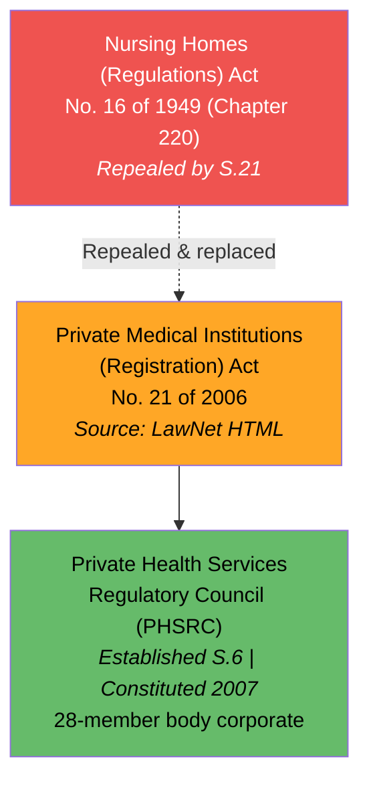
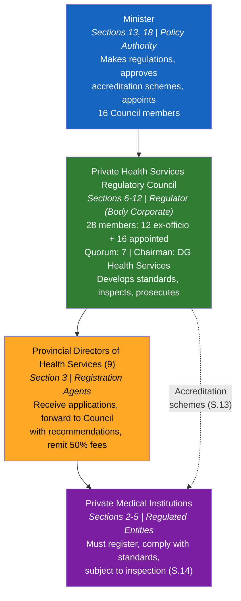
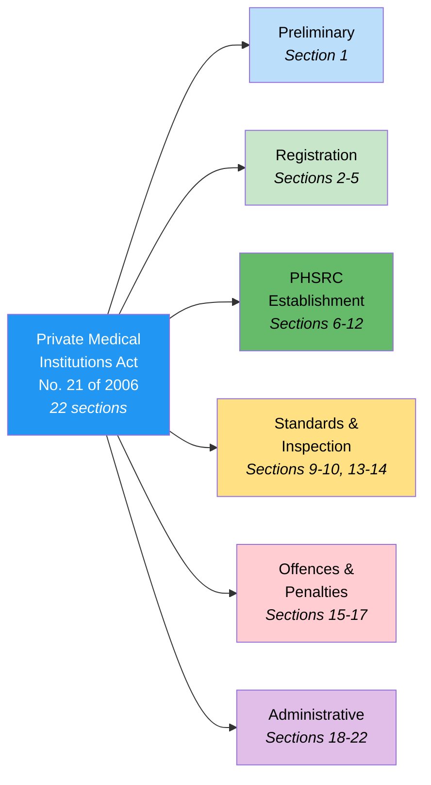
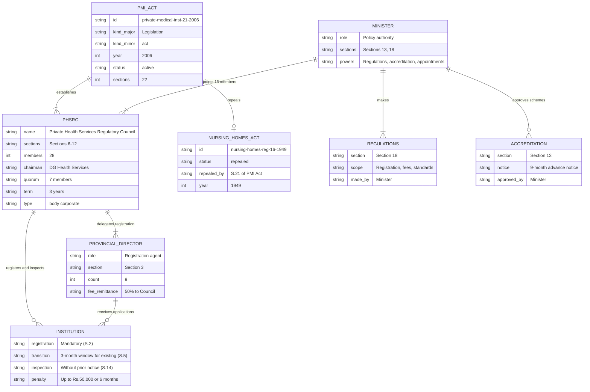

# Private Medical Institutions (Registration) Act — Lineage & Amendments

Visual diagrams showing the legislative lineage of the Private Medical Institutions (Registration) Act, No. 21 of 2006. This Act replaced the Nursing Homes (Regulations) Act of 1949, establishing the Private Health Services Regulatory Council (PHSRC) as the modern regulatory body for private healthcare in Sri Lanka. No amendments have been enacted.

## Amendment Flowchart

The 2006 Act has no amendments. The key legislative event is the **repeal** of the Nursing Homes (Regulations) Act (Chapter 220) via Section 21.

**Legend:** Orange = source available, Red = repealed, Green = statutory body established

### Source Documents

| Act | Year | Source | Link |
|-----|------|--------|------|
| Private Medical Institutions (Registration) Act, No. 21 of 2006 | 2006 | LawNet (HTML) | [View](http://www.lawnet.gov.lk/wp-content/uploads/Law%20Site/4-stats_1956_2006/set6/2006Y0V0C21A.html) |
| Nursing Homes (Regulations) Act, No. 16 of 1949 | 1949 | lankalaw.net (consolidated PDF) | [View](https://lankalaw.net/wp-content/uploads/2024/03/nh551326.pdf) |

:::note No amendments
This Act has not been amended since enactment. The PHSRC PDF at phsrc.lk is a scanned image and is not machine-readable.
:::

## Governance Hierarchy

The Act creates a four-tier regulatory structure. The Minister sets policy and approves accreditation schemes. The PHSRC (a 28-member body corporate) develops standards and oversees the sector. Provincial Directors of Health Services handle registration at the provincial level.

**Legend:** Blue = Minister, Green = PHSRC (regulator), Orange = Provincial Directors, Purple = regulated entities

## Act Structure

The Act has 22 sections organised into six functional groups:

**Legend:** Blue = general provisions, Green = establishment/governance, Yellow = standards/inspection, Red = offences, Purple = administrative

## Entity-Relationship Diagram

