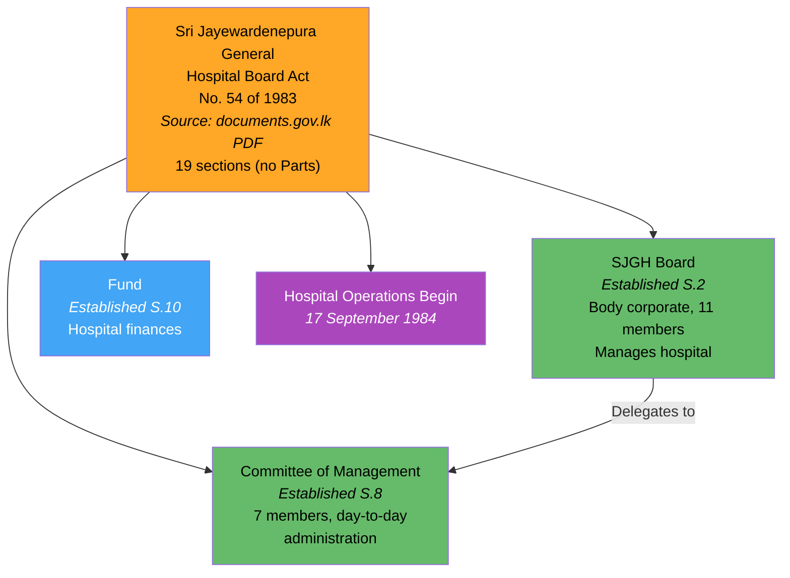
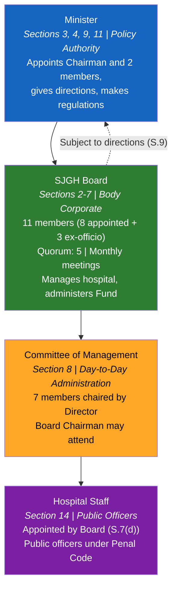
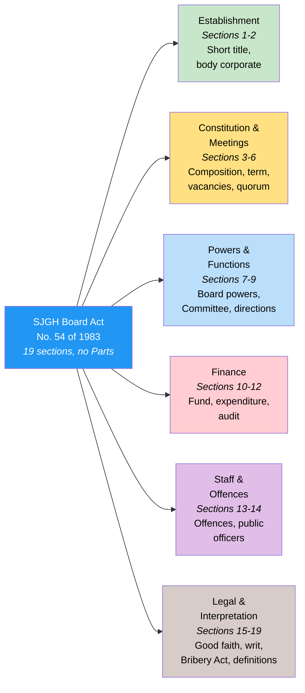
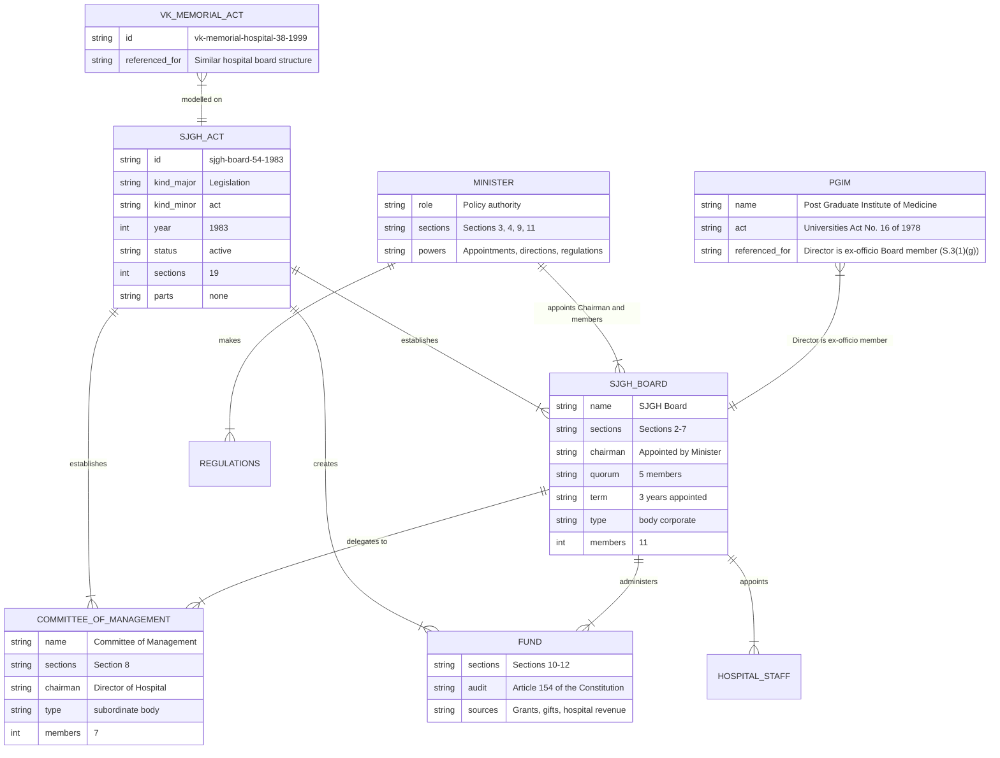

# Sri Jayewardenepura General Hospital Board Act — Lineage & Amendments

Visual diagrams showing the legislative lineage of the Sri Jayewardenepura General Hospital Board Act, No. 54 of 1983. This Act establishes the Sri Jayewardenepura General Hospital Board as a body corporate with perpetual succession, creates a Committee of Management for day-to-day administration, and establishes a dedicated Fund for hospital finances. No amendments have been enacted in over 40 years.

## Act Overview

The 1983 Act has no amendments. It establishes two governance bodies and a dedicated Fund.

**Legend:** Orange = source available, Green = statutory bodies established, Blue = fund, Purple = operational milestone

### Source Documents

| Act | Year | Source | Link |
|-----|------|--------|------|
| Sri Jayewardenepura General Hospital Board Act, No. 54 of 1983 | 1983 | documents.gov.lk (PDF) | [View](https://documents.gov.lk/view/acts/1983/12/54-1983_E.pdf) |
| Also listed at srilankalaw.lk | 1983 | srilankalaw.lk | [View](https://www.srilankalaw.lk/s/1142-sri-jayewardenepura-general-hospital-board-act.html) |

:::note No amendments
This Act has not been amended since enactment in 1983 — over 40 years unamended. Exhaustive search of parliament.lk, documents.gov.lk, and srilankalaw.lk confirmed no amending legislation.
:::

## Governance Hierarchy

The Act creates a four-tier structure. The Minister sets policy, appoints the Board Chairman, and makes regulations. The Board (11 members, quorum 5) manages the hospital as a body corporate. The Committee of Management (7 members) handles day-to-day administration. Hospital staff are public officers.

**Legend:** Blue = Minister, Green = SJGH Board, Orange = Committee of Management, Purple = Hospital Staff

## Act Structure

The Act has 19 sections in a single continuous body (no formal Parts). Sections are organised into 6 functional groups:

**Legend:** Blue = Act, Green = establishment, Yellow = constitution & meetings, Light blue = powers & functions, Red (light) = finance, Purple (light) = staff & offences, Brown (light) = legal & interpretation

## Entity-Relationship Diagram

