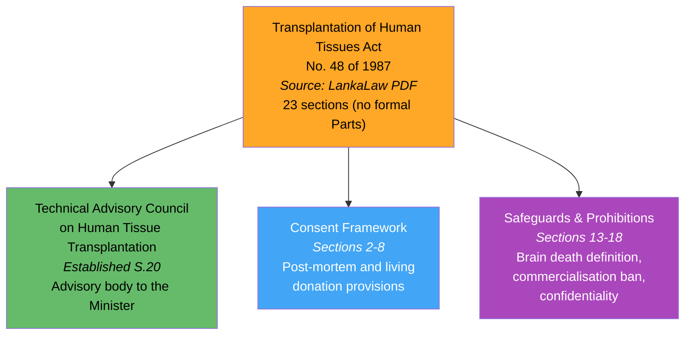
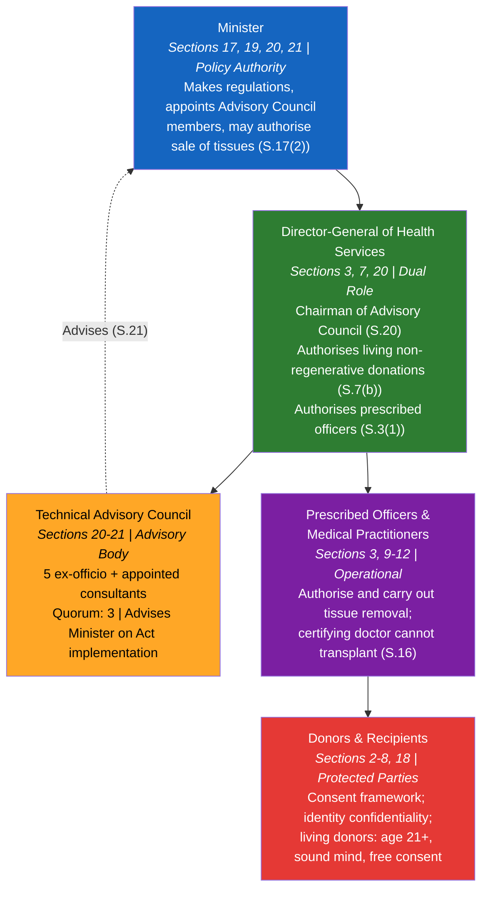
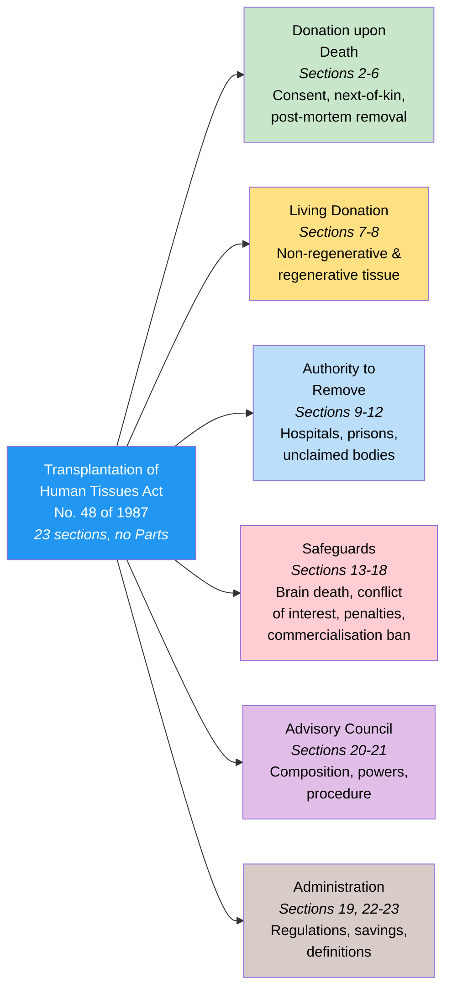
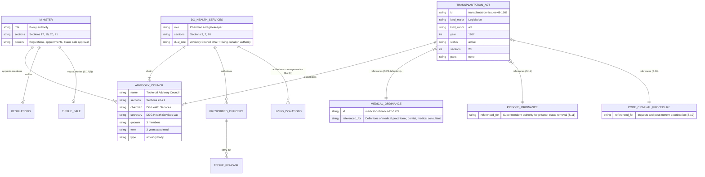

# Transplantation of Human Tissues Act — Lineage & Amendments

Visual diagrams showing the legislative lineage of the Transplantation of Human Tissues Act, No. 48 of 1987. This Act provides the legal framework for organ and tissue transplantation in Sri Lanka, defines brain death, and establishes the Technical Advisory Council on Human Tissue Transplantation. No amendments have been enacted in 37 years.

## Amendment Flowchart

The 1987 Act has no amendments. The sole structural outcome is the establishment of the Technical Advisory Council.

**Legend:** Orange = source available, Green = statutory body established, Blue = consent framework, Purple = safeguards

### Source Documents

| Act | Year | Source | Link |
|-----|------|--------|------|
| Transplantation of Human Tissues Act, No. 48 of 1987 | 1987 | LankaLaw (PDF) | [View](https://lankalaw.net/wp-content/uploads/2024/02/3423.pdf) |
| Medical Ordinance, No. 26 of 1927 (referenced in definitions) | 1927 | SLMC website (PDF) | [View](http://www.au.slmc.gov.lk/wp-content/uploads/2023/02/Medical-Ordinance.pdf) |

:::note No amendments
This Act has not been amended since enactment in 1987 — 37 years unamended.
:::

## Governance Hierarchy

The Act creates a five-tier structure. The Minister sets policy and makes regulations. The Director-General of Health Services plays a dual role as Chairman of the Advisory Council and gatekeeper for living non-regenerative tissue donations. The Advisory Council advises the Minister on implementation.

**Legend:** Blue = Minister, Green = DG Health Services, Orange = Advisory Council, Purple = medical practitioners, Red = donors/recipients

## Act Structure

The Act has 23 sections in a single continuous body (no formal Parts). Sections are organised into 6 functional groups:

**Legend:** Blue = Act, Green = donation upon death, Yellow = living donation, Light blue = authority to remove, Red (light) = safeguards, Purple (light) = Advisory Council, Brown (light) = administration

## Entity-Relationship Diagram

