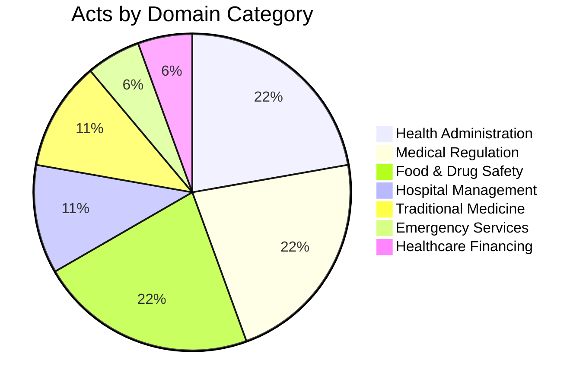

import MinistryOverview from '@site/src/components/MinistryOverview';

# Health Ministry Legislative Ecosystem

The Minister of Health is responsible for **18 Acts and Ordinances** spanning health administration, medical regulation, food and drug safety, hospital management, traditional medicine, and emergency services.

## Domain Distribution

## Acts Catalog

Use the search box to filter by title, number, or summary. Select a domain category to narrow results. Click any act card to expand details including amendments and cross-references.

<MinistryOverview />

## Key Observations

- The oldest legislation dates to **1873** (Mental Disease Ordinance), while the most recent is from **2018** (1990 Suwaseriya Foundation Act)
- **4 Ordinances** predate independence (1912-1929) and remain in force
- Only the **Health Services Act** has received deep structural analysis so far
- Several acts establish standalone statutory bodies (NMRA, Nurses' Council, NATA) that warrant their own deep dives
