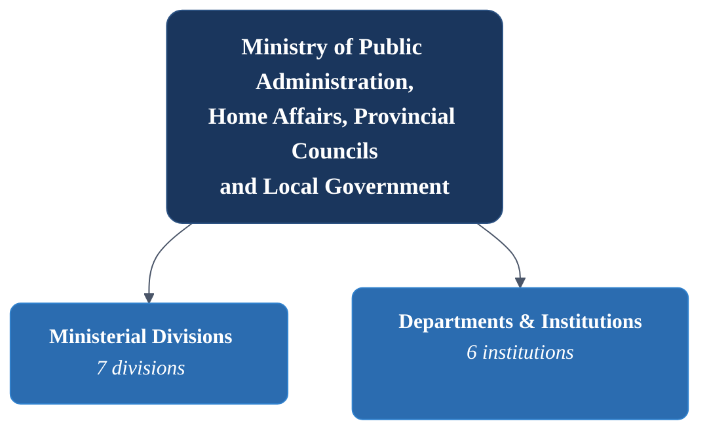
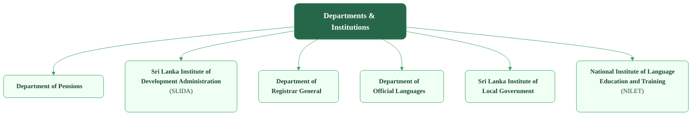

# Sri Lanka Administrative Service

ALPHAEarly Research — AI-Extracted Data

:::danger[AI-Extracted Data — Human Verification Required]
This is **very early-stage research**. The seniority list data was **extracted from PDF documents using AI** (large language models). While we have cross-checked totals and structure, **individual data points may contain errors** — misspelt names, incorrect dates, or misclassified posts. All analytics derived from this data (demographics, promotion velocity, ministry distribution) inherit these risks.

**Do not treat any figure in this section as authoritative.** Independent verification against the [official PDF seniority lists](https://pubad.gov.lk/web/index.php?option=com_content&view=article&id=31&Itemid=136&lang=en) is required before citing or acting on this data.
:::

This section covers the **Ministry of Public Administration, Home Affairs, Provincial Councils and Local Government** — the central ministry responsible for public service management, administrative reforms, and the Sri Lanka Administrative Service (SLAS).

## Administrative Hierarchy

The following charts illustrate the administrative hierarchy of the Ministry. Click on any node to visit its official webpage.

### Ministry Structure

### Ministerial Divisions

```mermaid
%%{init: {'theme': 'base', 'themeVariables': {'fontSize': '16px', 'fontFamily': 'system-ui, sans-serif', 'lineColor': '#3182ce'}}}%%
graph TD
    Divisions["<b>Ministerial Divisions</b>"]:::header

    Divisions --> Div_AdminService["<b>Administrative Service</b><br/>Division"]:::div
    click Div_AdminService "https://pubad.gov.lk/web/index.php?option=com_content&view=article&id=26&Itemid=303&lang=en"

    Divisions --> Div_Est["<b>Establishments</b><br/>Division"]:::div
    click Div_Est "https://pubad.gov.lk/web/index.php?option=com_content&view=article&id=11&Itemid=116&lang=en"

    Divisions --> Div_CombServ["<b>Combined Services</b><br/>Division"]:::div
    click Div_CombServ "https://pubad.gov.lk/web/index.php?option=com_content&view=article&id=12&Itemid=117&lang=en"

    Divisions --> Div_HRD["<b>Human Resource</b><br/><b>Development</b> Division"]:::div
    click Div_HRD "https://pubad.gov.lk/web/index.php?option=com_content&view=article&id=21&Itemid=300&lang=en"

    Divisions --> Div_Ref["<b>Public Service Reforms</b><br/>Division"]:::div
    click Div_Ref "https://pubad.gov.lk/web/index.php?option=com_content&view=article&id=157&Itemid=358&lang=en"

    Divisions --> Div_IT["<b>Information Technology</b><br/>Division"]:::div
    click Div_IT "https://pubad.gov.lk/web/index.php?option=com_content&view=article&id=22&Itemid=131&lang=en"

    Divisions --> Div_Fin["<b>Finance</b><br/>Division"]:::div
    click Div_Fin "https://pubad.gov.lk/web/index.php?option=com_content&view=article&id=15&Itemid=120&lang=en"

    classDef header fill:#2b6cb0,stroke:#3182ce,color:#ffffff,font-size:18px,rx:10,ry:10
    classDef div fill:#ebf8ff,stroke:#3182ce,color:#1a365d,font-size:15px,rx:8,ry:8
```

### Departments & Institutions

## Departments & Institutions

The main departments and statutory bodies functioning under the Ministry:

| # | Institution | Description |
|---|------------|-------------|
| 1 | **Department of Pensions** | Manages pension schemes for public sector employees |
| 2 | **Department of Registrar General** | Handles registration of legal documents and vital statistics |
| 3 | **Department of Official Languages** | Implements the Official Language Policy |
| 4 | **Sri Lanka Institute of Development Administration (SLIDA)** | The premier public sector training organization |
| 5 | **Sri Lanka Institute of Local Government** | Enhances the capacity of local government authorities |
| 6 | **Distance Learning Centre Ltd.** | — |
| 7 | **Public Service Pensioners' Trust Fund** | — |
| 8 | **Official Languages Commission** | — |
| 9 | **National Human Resources Development Council of Sri Lanka** | — |

## SLAS Officers

The list of SLAS officers is managed by the **Administrative Service Division** under the "All Island Services" category.

Seniority Lists for each grade (PDF downloads):

| Grade | Link |
|-------|------|
| Special Grade | [Download Seniority List](https://pubad.gov.lk/web/images/seniority_list/slas-sp-grade-seniority-list.pdf) |
| Class I (Grade I) | [Download Seniority List](https://pubad.gov.lk/web/images/seniority_list/slas-grade-i-seniority-list.pdf) |
| Class II (Grade II) | [Download Seniority List](https://pubad.gov.lk/web/images/seniority_list/slas-grade-ii-seniority-list.pdf) |
| Class III (Grade III) | [Download Seniority List](https://pubad.gov.lk/web/images/seniority_list/slas-grade-iii-seniority-list.pdf) |

:::note
These lists are typically updated periodically. Check the [Administrative Service Page](https://pubad.gov.lk/web/index.php?option=com_content&view=article&id=31&Itemid=136&lang=en) for the latest versions under the "Seniority List" accordion.
:::

## Data Source

Content in this section is based on publicly available information from the [Ministry of Public Administration](https://pubad.gov.lk/) and its affiliated departments.
