# SLAS Officer Tracking System

Track **Sri Lanka Administrative Service** officers across 6 years (2021–2026), 4 grades, and 2,100+ institutions. Supports bidirectional queries: officer → career timeline, and institution → officer roster over time.

## Data Overview

| Item | Count |
|------|-------|
| Unique Officers | 2,953 |
| Yearly Snapshots | 15,138 |
| Institutions | 2,149 |
| Years Covered | 2021–2026 |
| Grades | Special Grade, Grade I, Grade II, Grade III |

**Data sources:**
- `raw_data/` — 20 PDFs + 16 XLSX files from pubad.gov.lk seniority lists
- `data/` — 24 extracted JSON files (4 grades x 6 years) + post classification taxonomy
- `app/data/slas.db` — SQLite database (generated from JSON)

## Quick Start (Docker)

The fastest way to run the app. A single Dockerfile bootstraps everything — builds the SQLite database from JSON and serves the Next.js app.

```bash
cd slas

# Build the image (builds DB + app from scratch)
docker build -t slas-tracker .

# Run the container
docker run -d --name slas-tracker -p 3007:3007 slas-tracker

# Open in browser
open http://localhost:3007

# Stop and remove
docker rm -f slas-tracker
```

The Docker build has 3 stages:
1. **db-builder** — Runs `build-db.ts` to create `slas.db` from the 24 JSON files
2. **app-builder** — Installs dependencies and builds the Next.js app (standalone mode)
3. **runner** — Slim production image (~393 MB) with just the server + database

> The SQLite database is **always rebuilt from JSON** during `docker build`. If you delete `slas.db` or change any JSON file, just rebuild the image.

## Local Development Setup

### Prerequisites

- **Node.js** 20+ and npm
- **Python** 3.9+ (only needed for re-extracting data from XLSX/PDF sources)

### 1. Build the SQLite Database

The database is built from the JSON files in `data/`. If `app/data/slas.db` is missing or you've updated any JSON files, rebuild it:

```bash
cd slas/scripts

# Install dependencies (first time only)
npm install

# Build the database
npx tsx build-db.ts
```

This reads all `data/YYYY_*.json` files, resolves officer identities by `fileNumber`, normalizes posts using `data/slas-post-classification.json`, and outputs `app/data/slas.db`.

**Output:**
```
=== Database Summary ===
  Officers:     2953
  Snapshots:    15138
  Institutions: 2149
  Database:     .../slas/app/data/slas.db
```

### 2. Run the Next.js App

```bash
cd slas/app

# Install dependencies (first time only)
npm install

# Start development server
npm run dev
```

Open **http://localhost:3007** in your browser.

For a production build:
```bash
npm run build
npm run start
```

### 3. Re-extract Data from Source Files (Optional)

Only needed if you want to re-extract JSON from the raw XLSX/PDF files in `raw_data/`.

**From XLSX (2021–2024):**
```bash
cd slas

# Create and activate Python virtual environment
python3 -m venv .venv
source .venv/bin/activate
pip install openpyxl

# Extract all years
python scripts/extract_xlsx.py

# Or extract a specific file
python scripts/extract_xlsx.py 2024_grade_i

# Or extract all grades for a year
python scripts/extract_xlsx.py --year 2023
```

**From PDF (2025):**
```bash
source .venv/bin/activate
pip install pdfplumber

python scripts/extract_pdf.py
```

The 2026 data was pre-extracted and doesn't have corresponding source files in `raw_data/`.

After re-extraction, rebuild the database (step 1).

## Project Structure

```
slas/
├── Dockerfile                 # Multi-stage: DB build → App build → Runner
├── .dockerignore
├── README.md
├── raw_data/                  # Source PDFs (20) and XLSX (16) files
├── data/                      # Extracted JSON (24 files + taxonomy)
│   ├── 2021_sp_grade.json ... 2026_grade_iii.json
│   └── slas-post-classification.json
├── scripts/                   # Data pipeline
│   ├── build-db.ts            # JSON → SQLite database builder
│   ├── extract_xlsx.py        # XLSX → JSON extraction (2021-2024)
│   ├── extract_pdf.py         # PDF → JSON extraction (2025)
│   ├── tsconfig.json
│   └── package.json
└── app/                       # Next.js application
    ├── package.json
    ├── next.config.js
    ├── tsconfig.json
    ├── tailwind.config.ts
    ├── data/
    │   └── slas.db            # SQLite database (generated)
    └── src/
        ├── lib/
        │   ├── db.ts          # SQLite queries
        │   └── types.ts       # TypeScript types
        ├── components/
        │   ├── GradeBadge.tsx
        │   ├── OfficerCard.tsx
        │   ├── OfficerTimeline.tsx
        │   ├── SearchBar.tsx
        │   └── YearFilter.tsx
        └── app/
            ├── layout.tsx
            ├── page.tsx                    # Dashboard
            ├── officers/
            │   ├── page.tsx                # Officer search
            │   └── [fileNumber]/page.tsx   # Officer career timeline
            ├── institutions/
            │   ├── page.tsx                # Institution search
            │   └── [id]/page.tsx           # Institution roster
            └── api/
                ├── officers/route.ts
                ├── officers/[fileNumber]/route.ts
                ├── institutions/route.ts
                ├── institutions/[id]/route.ts
                └── stats/route.ts
```

## Application Pages

| Page | URL | Description |
|------|-----|-------------|
| Dashboard | `/` | Summary stats, grade distribution, yearly breakdown table |
| Officer Search | `/officers` | Search by name/file number, filter by grade and year |
| Officer Timeline | `/officers/[fileNumber]` | Career timeline with promotion and transfer highlights |
| Institution Search | `/institutions` | Search and filter by type (ministry, department, etc.) |
| Institution Roster | `/institutions/[id]` | Year-by-year officer roster grouped by grade |

## API Endpoints

| Endpoint | Description |
|----------|-------------|
| `GET /api/officers?q=&grade=&year=&page=&limit=` | Search officers |
| `GET /api/officers/:fileNumber` | Officer detail + all yearly snapshots |
| `GET /api/institutions?q=&type=&page=&limit=` | Search institutions |
| `GET /api/institutions/:id` | Institution detail + officers by year |
| `GET /api/stats` | Dashboard aggregate statistics |

## Database Schema

Three tables with identity resolution by `fileNumber`:

- **officers** — One row per unique person (2,953 rows). Stores latest name, grade, post, workplace, and all promotion dates.
- **snapshots** — One row per officer-year observation (15,138 rows). Records grade, seniority number, post, and institution for each year.
- **institutions** — Normalized institution names with type classification (2,149 rows).

Officers are matched across years and grades using `fileNumber` (e.g., `75/10/3259`). The `build-db.ts` script uses UPSERT logic to merge records, keeping the latest year's data as the "current" state.

## Data Pipeline

```
XLSX/PDF sources (raw_data/)
    ↓  extract_xlsx.py / extract_pdf.py
JSON snapshots (data/YYYY_grade.json)
    ↓  build-db.ts
SQLite database (app/data/slas.db)
    ↓  Next.js app (lib/db.ts)
Web UI (localhost:3007)
```

## Ministry Administrative Hierarchy

The following chart illustrates the administrative hierarchy and key divisions of the Ministry. Click on the nodes to visit the respective webpages.

```mermaid
graph TD
    %% Main Ministry Node
    Ministry["Ministry of Public Administration, <br>Home Affairs, Provincial Councils <br>and Local Government"]
    click Ministry "https://pubad.gov.lk/web/index.php?option=com_content&view=featured&Itemid=101&lang=en" "Visit Ministry Homepage"

    %% Main Sub-groups
    Divisions["Ministerial Divisions"]
    Institutions["Departments & Institutions"]

    Ministry --> Divisions
    Ministry --> Institutions

    %% Divisions
    Divisions --> Div_AdminService["Administrative Service Division"]
    click Div_AdminService "https://pubad.gov.lk/web/index.php?option=com_content&view=article&id=26&Itemid=303&lang=en"
    
    Divisions --> Div_Est["Establishments Division"]
    click Div_Est "https://pubad.gov.lk/web/index.php?option=com_content&view=article&id=11&Itemid=116&lang=en"
    
    Divisions --> Div_CombServ["Combined Services Division"]
    click Div_CombServ "https://pubad.gov.lk/web/index.php?option=com_content&view=article&id=12&Itemid=117&lang=en"

    Divisions --> Div_HRD["Human Resource Development Division"]
    click Div_HRD "https://pubad.gov.lk/web/index.php?option=com_content&view=article&id=21&Itemid=300&lang=en"

    Divisions --> Div_Ref["Public Service Reforms Division"]
    click Div_Ref "https://pubad.gov.lk/web/index.php?option=com_content&view=article&id=157&Itemid=358&lang=en"

    Divisions --> Div_IT["Information Technology Division"]
    click Div_IT "https://pubad.gov.lk/web/index.php?option=com_content&view=article&id=22&Itemid=131&lang=en"
    
    Divisions --> Div_Fin["Finance Division"]
    click Div_Fin "https://pubad.gov.lk/web/index.php?option=com_content&view=article&id=15&Itemid=120&lang=en"

    %% Institutions
    Institutions --> Inst_Pensions["Department of Pensions"]
    click Inst_Pensions "https://www.pensions.gov.lk/"
    
    Institutions --> Inst_SLIDA["Sri Lanka Institute of <br>Development Administration (SLIDA)"]
    click Inst_SLIDA "https://www.slida.lk/"

    Institutions --> Inst_RGD["Department of Registrar General"]
    click Inst_RGD "https://www.rgd.gov.lk/"

    Institutions --> Inst_DOL["Department of Official Languages"]
    click Inst_DOL "https://www.languagesdept.gov.lk/"

    Institutions --> Inst_SLILG["Sri Lanka Institute of <br>Local Government"]
    click Inst_SLILG "https://slilg.lk/"
    
    Institutions --> Inst_NILET["National Institute of Language <br>Education and Training (NILET)"]
    click Inst_NILET "https://nilet.gov.lk/"
```



## SLAS Seniority Lists (Source)

The seniority lists are published by the Administrative Service Division:

- **Special Grade**: [Download PDF](https://pubad.gov.lk/web/images/seniority_list/slas-sp-grade-seniority-list.pdf)
- **Grade I**: [Download PDF](https://pubad.gov.lk/web/images/seniority_list/slas-grade-i-seniority-list.pdf)
- **Grade II**: [Download PDF](https://pubad.gov.lk/web/images/seniority_list/slas-grade-ii-seniority-list.pdf)
- **Grade III**: [Download PDF](https://pubad.gov.lk/web/images/seniority_list/slas-grade-iii-seniority-list.pdf)

> These lists are updated periodically. Check the [Administrative Service Page](https://pubad.gov.lk/web/index.php?option=com_content&view=article&id=31&Itemid=136&lang=en) for the latest versions.
