# Ministry of Public Administration, Home Affairs, Provincial Councils and Local Government

## Administrative Hierarchy

The following chart illustrates the administrative hierarchy and key divisions of the Ministry. Click on the nodes to visit the respective webpages.

```mermaid
graph TD
    %% Main Ministry Node
    Ministry["Ministry of Public Administration, <br>Home Affairs, Provincial Councils <br>and Local Government"]
    click Ministry "https://pubad.gov.lk/web/index.php?option=com_content&view=featured&Itemid=101&lang=en" "Visit Ministry Homepage"

    %% Main Sub-groups
    Divisions["Ministerial Divisions"]
    Institutions["Departments & Institutions"]

    Ministry --> Divisions
    Ministry --> Institutions

    %% Divisions
    Divisions --> Div_AdminService["Administrative Service Division"]
    click Div_AdminService "https://pubad.gov.lk/web/index.php?option=com_content&view=article&id=26&Itemid=303&lang=en"
    
    Divisions --> Div_Est["Establishments Division"]
    click Div_Est "https://pubad.gov.lk/web/index.php?option=com_content&view=article&id=11&Itemid=116&lang=en"
    
    Divisions --> Div_CombServ["Combined Services Division"]
    click Div_CombServ "https://pubad.gov.lk/web/index.php?option=com_content&view=article&id=12&Itemid=117&lang=en"

    Divisions --> Div_HRD["Human Resource Development Division"]
    click Div_HRD "https://pubad.gov.lk/web/index.php?option=com_content&view=article&id=21&Itemid=300&lang=en"

    Divisions --> Div_Ref["Public Service Reforms Division"]
    click Div_Ref "https://pubad.gov.lk/web/index.php?option=com_content&view=article&id=157&Itemid=358&lang=en"

    Divisions --> Div_IT["Information Technology Division"]
    click Div_IT "https://pubad.gov.lk/web/index.php?option=com_content&view=article&id=22&Itemid=131&lang=en"
    
    Divisions --> Div_Fin["Finance Division"]
    click Div_Fin "https://pubad.gov.lk/web/index.php?option=com_content&view=article&id=15&Itemid=120&lang=en"

    %% Institutions
    Institutions --> Inst_Pensions["Department of Pensions"]
    click Inst_Pensions "https://www.pensions.gov.lk/"
    
    Institutions --> Inst_SLIDA["Sri Lanka Institute of <br>Development Administration (SLIDA)"]
    click Inst_SLIDA "https://www.slida.lk/"

    Institutions --> Inst_RGD["Department of Registrar General"]
    click Inst_RGD "https://www.rgd.gov.lk/"

    Institutions --> Inst_DOL["Department of Official Languages"]
    click Inst_DOL "https://www.languagesdept.gov.lk/"

    Institutions --> Inst_SLILG["Sri Lanka Institute of <br>Local Government"]
    click Inst_SLILG "https://slilg.lk/"
    
    Institutions --> Inst_NILET["National Institute of Language <br>Education and Training (NILET)"]
    click Inst_NILET "https://nilet.gov.lk/"
```

## Main Departments

The main departments and statutory bodies functioning under the Ministry include:

1.  **Department of Pensions**: Manages pension schemes for public sector employees.
2.  **Department of Registrar General**: Handles registration of specific legal documents and vital statistics.
3.  **Department of Official Languages**: Implements the Official Language Policy.
4.  **Sri Lanka Institute of Development Administration (SLIDA)**: The premier public sector training organization.
5.  **Sri Lanka Institute of Local Government**: Focuses on enhancing the capacity of local government authorities.
6.  **Distance Learning Centre Ltd.**
7.  **Public Service Pensioners’ Trust Fund**
8.  **Official Languages Commission**
9.  **National Human Resources Development Council of Sri Lanka**

## SLAS Officers (Sri Lanka Administrative Service)

The list of SLAS officers is managed by the **Administrative Service Division** under the "All Island Services" category.

You can find the Seniority Lists for each grade at the following direct links (PDFs):

*   **Special Grade**: [Download Seniority List](https://pubad.gov.lk/web/images/seniority_list/slas-sp-grade-seniority-list.pdf)
*   **Class I (Grade I)**: [Download Seniority List](https://pubad.gov.lk/web/images/seniority_list/slas-grade-i-seniority-list.pdf)
*   **Class II (Grade II)**: [Download Seniority List](https://pubad.gov.lk/web/images/seniority_list/slas-grade-ii-seniority-list.pdf)
*   **Class III (Grade III)**: [Download Seniority List](https://pubad.gov.lk/web/images/seniority_list/slas-grade-iii-seniority-list.pdf)

> **Note**: These lists are typically updated periodically. You can always check for the latest versions on the [Administrative Service Page](https://pubad.gov.lk/web/index.php?option=com_content&view=article&id=31&Itemid=136&lang=en) under the "Seniority List" accordion.
